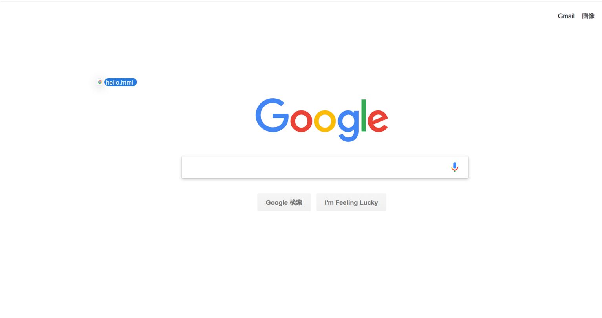
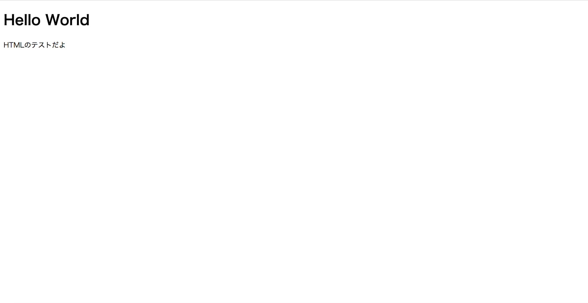

# STEP1-3.HTMLとCSSについて

### HTML

HTMLはWebページを記述するための言語です。HTMLではタグを使って要素を記述します。<タグ名>を開始タグ、</タグ名>を終了タグといい、開始タグと終了タグの間に書いたものがそのタグの内容となります。（終了タグがないタグもあります。）

最低限のHTMLファイルは以下のようなものになります。

```html
<!DOCTYPE html>
<html>
  <head>
    <meta charset="UTF-8" />
    <title>Hello World</title>
  </head>
  <body>
    <h1>Hello World</h1>
    <p>HTMLのテストだよ</p>
  </body>
</html>
```

これを開発環境のインストールディレトリのapp（skillup-php-step1-master/app/）の中にhello.htmlという名前で保存してみましょう。その際文字コードはUTF-8にしてください。メモ帳の場合、文字コードの選択は保存ボタンの左側にあります。

では、作ったファイルが実際どのように表示されるかみてみましょう。
作ったファイルをchromeなどのブラウザにドラック&ドロップしてみてください。


以下のような画面が表示されるはずです。

ファイルの文字を変更して保存してから表示させると画面の文字も変わっていると思います。htmlファイルはこのようにブラウザで表示することができます。
<!-- Windows10のhomeEditionの方は[http://「Docker環境のIPアドレス」:9000/hello.html]()に、それ以外の方は[http://localhost:9000/hello.html](http://localhost:9000/hello.html)にアクセスしてみてください。ページが表示されるはずです。 -->

各タグの概要は以下になります。

| タグ | 役割 |
|:----|:----|
| &lt;!DOCTYPE html&gt;                 | HTML5で作成されたファイルであることを示すタグです。最近はHTML5が主流になりました。 |
| &lt;head&gt;～&lt;/head&gt;           | ページの情報を表します。 |
| &lt;meta charset=&quot;～&quot; /&gt; | 文字コードを指定します。 |
| &lt;title&gt;～&lt;/title&gt;         | ブラウザのタイトルバーに表示するタイトルです。 |
| &lt;body&gt;～&lt;/body&gt;           | このタグの中にページの内容を書いていきます。 |
| &lt;h1&gt;～&lt;h1&gt;                | 見出しです。h6まであり、数字が大きくなるほど文字が小さくなります。 |
| &lt;p&gt;～&lt;/p&gt;                 | 段落を表します。 |

そのほかにも様々なタグがあります。[HTML5リファレンス](http://www.htmq.com/html5/)に詳しく載っていますので色々試してみてください。

### CSS

CSSはHTMLの要素の見た目を指定するものです。先ほどのhello.htmlを以下のように修正してください。

```html
<!DOCTYPE html>
<html>
  <head>
    <meta charset="UTF-8" />
    <title>HTMLのサンプル</title>
    <link rel="stylesheet" href="hello.css">
  </head>
  <body>
    <h1>HTMLのサンプル</h1>
    <p>こんにちは</p>
    <p id="red">赤いこんにちは</p>
    <p class="big">大きいこんにちは</p>
    <p class="blue">青いこんにちは</p>
    <p class="big blue">青くて大きいこんにちは</p>
  </body>
</html>
```

各要素の概要は以下になります。

| 要素 | 役割 |
|:----|:----|
| &lt;link rel=&quot;stylesheet&quot; href=&quot;～&quot;&gt; | CSSを読み込む処理です。 |  
| id="～"    | タグにIDを設定できます。同一ページ内に同じIDが存在してはいけません。  
| class="～" | タグにclassを設定できます。複数指定することもできます。idやclassはCSSで装飾する要素を指定するときに使用します。  

さて、新たにhello.cssというファイルを以下のように作成します。

```css
p {
  text-decoration: underline;
}
 
#red {
  color: #FF0000;
}
 
.big {
  font-size: 1.5em;
}
 
.blue {
  color: blue;
}
```
CSSは先頭で指定した要素全てに対して{}で囲まれた内容を適用するという構文になっています。先頭に何も付けないとタグ名、先頭に#を付けるとid名、先頭に.を付けるとclass名を指定できます。どのようなことができるかについては[スタイルシートリファレンス](http://www.htmq.com/style/)に載っていますので試してみてください。

また、Webブラウザには様々な種類があり、ブラウザごとにHTMLやCSSの[レンダリングエンジン](http://e-words.jp/w/E383ACE383B3E38380E383AAE383B3E382B0.html)が異なるため、あるブラウザでしか使用できないタグや、あるブラウザでは崩れてしまうレイアウトなどがあるかもしれません。そのため様々なブラウザでチェックする必要があるでしょう。

***

**[課題]フォームを作ってみよう**  
掲示板には発言を投稿するためのフォームが必要です。フォームの作り方を調べて、HTMLとCSSを使って発言を書き込む部分と送信ボタンがあるフォームを作ってみましょう。
