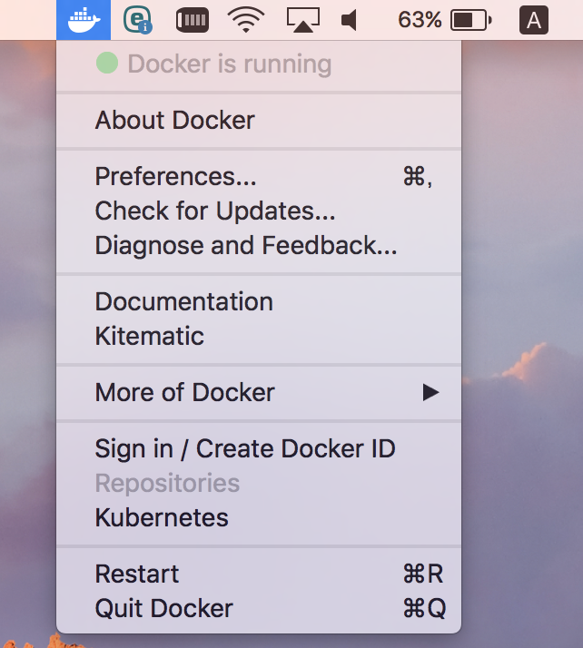

# STEP1-4.【Mac】Dockerと開発環境の作り方

本課題では実機に直接開発環境をインストールせずに、「Docker」と呼ばれるコンテナ型仮想化技術を用いて開発環境を構築します。  
Dockerを用いることによって従来型の仮想化技術のようにハードウェアの機能をすべてソフトウェアで実装するという高度な仕組みが不要になります。そのためDockerを用いることによって、高速で移植性の高い環境が容易に構築可能となります。

Dockerについての詳細な説明は割愛します。  
まずは下記の手順に従ってDockerで開発環境を構築してみましょう。

## 【Mac】Dockerによる環境構築手順

#### Dockerのダウンロード・インストール手順
* Dockerを[こちら](https://store.docker.com/editions/community/docker-ce-desktop-mac)からダウンロードします。画面右に「Please Login To Download」と書かれたボタンがあるのでこちらをクリック。  
* 画面下部の「Create Account」リンクからアカウント作成、ログインしてください。  
* ログイン後、再度[こちら](https://store.docker.com/editions/community/docker-ce-desktop-mac)にアクセスし、画面右の「Get Docker」ボタンからDockerをダウンロードしてください。
* ダウンロードしたファイルを実行してDockerをインストールしてください。以下のように「Docker is running」となっていればインストール成功です。



* 下記のコマンドを実行してDockerの動作を確認してみましょう。Dockerのバージョン情報が出力されます。  
```
$ docker -v
Docker version 18.06.0-ce, build 0ffa825
```
* こちらのコマンドも実行してみましょう
```
$ docker-compose -v
docker-compose version 1.22.0, build f46880f
```

#### Dockerによる開発環境の構築手順（PHP・PostgreSQL・Nginx・pgAdmin）
Dockerを使用して構築済みの開発環境をローカルマシンに導入します。

* [こちら](https://github.com/team-lab/skillup-php-step1)の「Clone or download」ボタンを押下し、「Download Zip」ボタン押下で開発環境をダウンロードします。
* ダウンロードしたファイルを任意の場所に解凍してください。
* ターミナルを開き解凍したフォルダーに移動します(以下は~/Downloadsで解凍した例)。
```
// 解凍したフォルダーに移動するコマンド
$ cd ~/Downloads/skillup-php-step1-master
```
* 移動したら以下のコマンドでコンテナを作成・開始します
```
$ docker-compose up -d
// 最終的に以下の表示になれば成功
Creating skillup-php-step1-master_php_1   ... done
Creating skillup-php-step1-master_nginx_1      ... done
Creating skillup-php-step1_pgsql_1   ... done
Creating skillup-php-step1_pgadmin_1 ... done
```

* 「docker ps」コマンドを入力し作成されたコンテナの一覧を確認します。「docker-compose up -d」コマンドが成功していたら以下のようにコンテナの一覧が表示される。
```
$ docker ps
// 以下の表示になれば成功
CONTAINER ID        IMAGE                     COMMAND                  CREATED             STATUS              PORTS                           NAMES
5a51c057e9d3        nginx                     "nginx -g 'daemon of…"   9 minutes ago       Up 9 minutes        0.0.0.0:9000->80/tcp            skillup-php-step1_nginx_1
3e5b91bd2d2d        skillup-php-step1_php     "docker-php-entrypoi…"   9 minutes ago       Up 9 minutes        9000/tcp                        skillup-php-step1_php_1
b1a75d41e914        dpage/pgadmin4            "/entrypoint.sh"         9 minutes ago       Up 9 minutes        443/tcp, 0.0.0.0:5050->80/tcp   skillup-php-step1_pgadmin_1
e961862278a7        skillup-php-step1_pgsql   "docker-entrypoint.s…"   9 minutes ago       Up 5 minutes        0.0.0.0:5432->5432/tcp          skillup-php-step1_pgsql_1
```

* この時点で開発環境が正常に立ち上がっているはずなので実際に動作できるか確認してみましょう。  
まずブラウザを開いて「[http://localhost:9000/index.html](http://localhost:9000/index.html)」にアクセスしてみましょう。以下のように表示されます。  
  
次に「[http://localhost:9000/check_db.php]()」にアクセスし、アプリケーションとDBが連携できているか確認しましょう。  
  
次に「[http://localhost:5050](http://localhost:5050)」にアクセスしてみましょう。「pgAdmin」が表示されます。  
  

* 正常に動作が確認できたら、「docker-compose down」コマンドで立ち上げたコンテナを削除してみましょう。
```
$ docker-compose down
// 以下の表示になれば成功
Stopping skillup-php-step1_nginx_1   ... done
Stopping skillup-php-step1_php_1     ... done
Stopping skillup-php-step1_pgadmin_1 ... done
Stopping skillup-php-step1_pgsql_1   ... done
Removing skillup-php-step1_nginx_1   ... done
Removing skillup-php-step1_php_1     ... done
Removing skillup-php-step1_pgadmin_1 ... done
Removing skillup-php-step1_pgsql_1   ... done
Removing network skillup-php-step1_default
```

* 「docker ps」コマンドを入力し一覧を確認します。先ほど作成したコンテナが表示されなくなっています。
```
$ docker ps
// 以下の表示になれば成功
CONTAINER ID        IMAGE                   COMMAND                  CREATED             STATUS              PORTS                            NAMES
```

* 「[http://localhost:9000](http://localhost:9000)」「[http://localhost:5050](http://localhost:5050)」にもアクセスできなくなっているかと思います。
