# STEP1-7.データベースについて

## リレーショナルデータベース

データの送信と受け取りができるようになったので次は保存です。

データは普通データベースに保存されます。データベースにも様々な種類があり、リレーショナルデータベースかそれ以外かに大別されます。  
ここではPostgreSQLというリレーショナルデータベースシステムを使用します。リレーショナルデータベースとは、データを表（テーブル）に保存し、複数の表の関係を連結することで1つのデータを表現するシステムです。

## PostgreSQLをpgAdminから触ってみよう

pgAdminはPostgreSQLサーバをウェブブラウザで管理するためのデータベース接続クライアントツールの一種です。これを利用する事で、視覚的にわかりやすい形でデータベースを操作することが可能になります。  
「[Dockerと開発環境の作り方](../04-docker.md)」での手順に従ってdocker-composeからコンテナを立ち上げると、以下のURLに自動的にこのpgAdminが立ち上がっていますので接続してみましょう。

Windows10のhomeEditionの方「 http://192.168.99.100:5050 」  
それ以外の方「 http://localhost:5050 」

アクセスすると以下のようなログイン画面が出ると思います。  

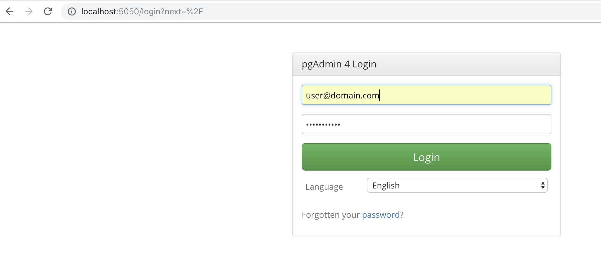  

初期ユーザーとパスワードは以下のようになります。  
ユーザー名：user@domain.com  
パスワード：SuperSecret  

なお、このユーザー名とパスワードは「[Dockerと開発環境の作り方](../04-docker.md)」でDLしたリポジトリの「docker-compose.yml」の32、33行目に記述したものになります。

### pgAdminにDBサーバを追加しよう

コンテナを立ち上げてからpgAdminに初めて接続した時には、pgAdminから操作するDBサーバは登録されていません。まずはDBサーバを追加しましょう。

Quick Linksの「Add New Server」をクリックするか、左側のServerを選択してから上部のタブにある「Object＞Create＞Server」をクリックしましょう。

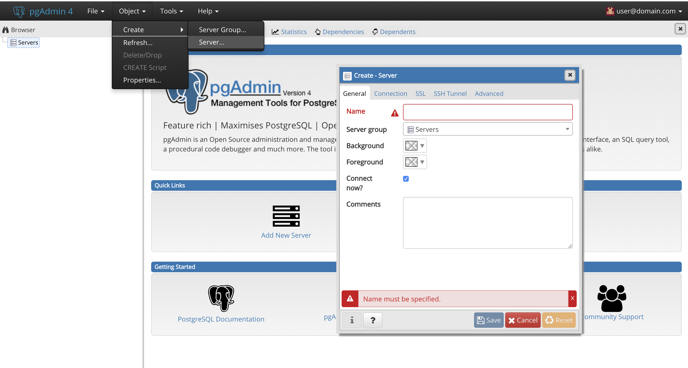

ポップアップしたサーバー追加フォームに情報を入力していきます。

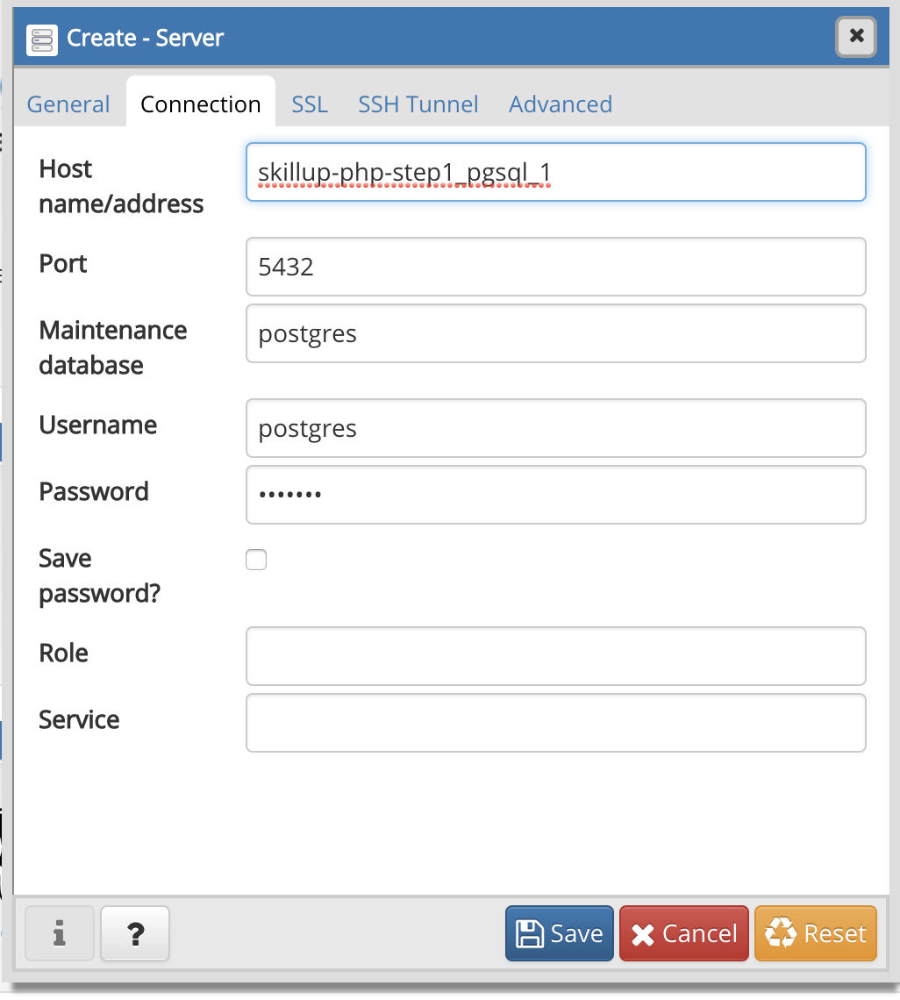

|フォーム|入力内容|説明|
|---|---|---|
| General＞Name　  | 好きな名前  | pgAdminで使う名前なので自由 |
| Connection＞Host name/address  | pgsql | DBが動いているIPアドレスやドメインを入れますが、今回はDockerで立ち上がっているコンテナ名 |
| Connection＞Port  | 5432  | docker-compose.ymlの19行目で設定した左側のポート番号 |
| Connection＞Maintenance database  |  postgres | docker-compose.ymlの26行目で設定したデータベース名 |
| Connection＞Username  | postgres  | docker-compose.ymlの25行目で設定したユーザ名 |
| Connection＞Password  | example  | docker-compose.ymlの24行目で設定したパスワード |

入力が終わったら「Save」ボタンをクリックしましょう。  
DBサーバの登録がうまくいけば、左側のServerの配下に「General＞Name」で設定した名前のDBサーバが追加されているはずです。

### DBを作成してみよう

DBサーバが追加できましたね？  
それでは、早速、DBを作成してみましょう。    

まずは、ブラウザの画面の左側の「Server」をクリックし、「General＞Name」で設定した名前のDBサーバを表示、そのDBサーバを選択します。  
右クリックして「Create＞Database」をクリックするか「Object＞Create＞Database」をクリックしましょう。

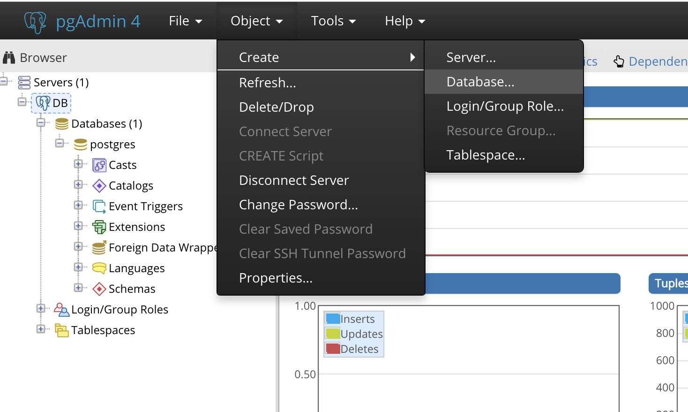

すると、以下のようなデータベース作成フォームがポップアップします。

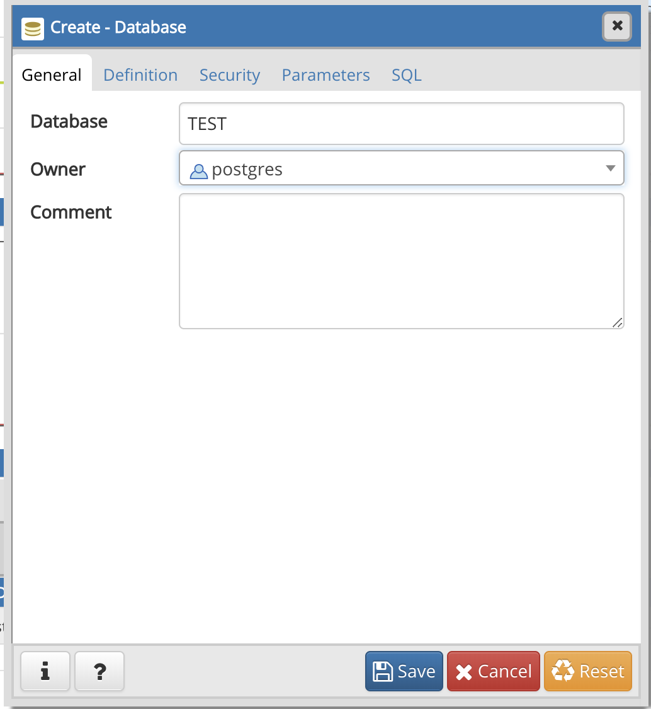

ここでは、TESTというDBを作成してみましょう。
general＞DatabaseのフォームにTESTと入力し「Save」をクリックします。
すると下図のように、左メニューに新しい階層が作られて、「TEST」というDBが作成されたことが確認できると思います。

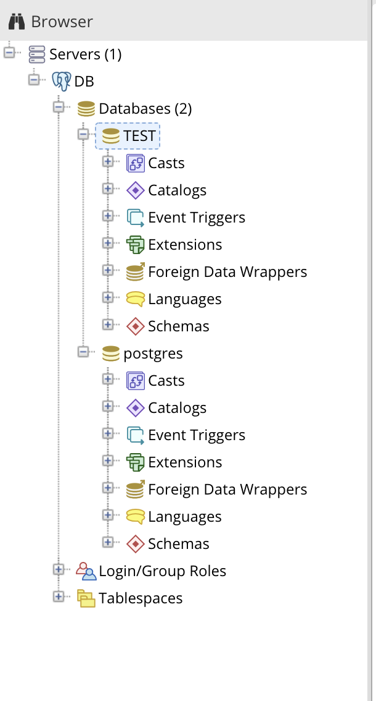

### テーブルを作成してみよう

うまくいきましたね。いい調子です！  
今度はテーブルを作成してみましょう。

先ほど作成したデータベースである「TEST」を選択します。  
すると、細かい項目が、沢山出てきます。  
それぞれいろんな機能がありますが、以下のように「Servers＞(DBサーバにつけた名前)＞Databases＞TEST＞Schemas＞public」という場所を選択しましょう。

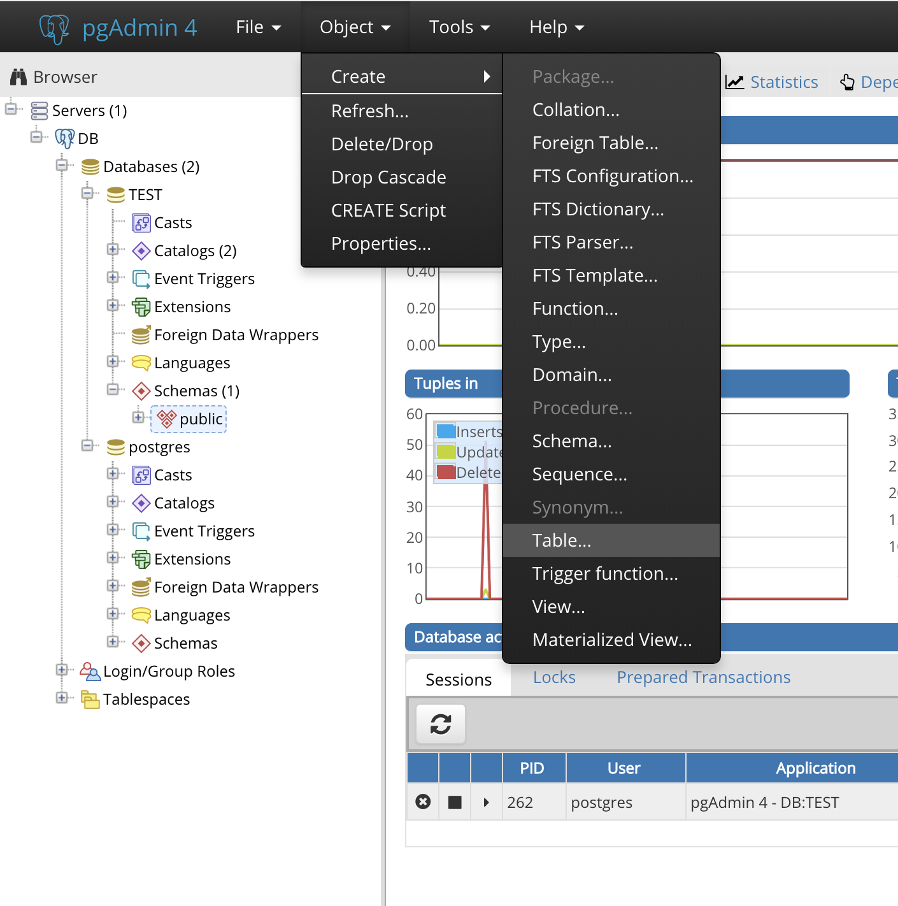

右クリックして「Create＞Table」をクリックするか「Object＞Create＞Table」をクリックしましょう。
すると、以下のようなテーブル作成フォームがポップアップします。

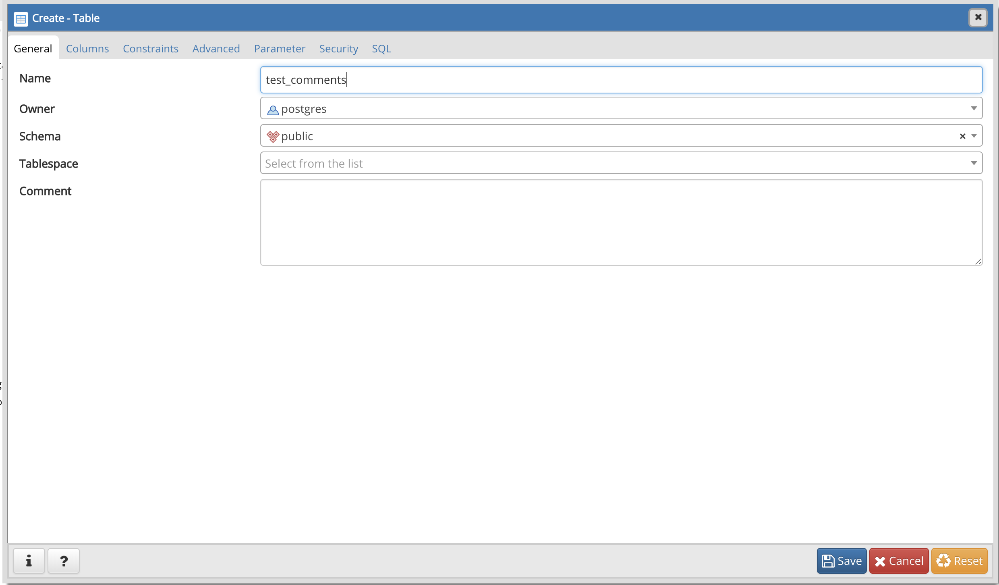

テーブル作成は入力が少し複雑なので頑張りましょう。  
まずは「Genaral」タブでテーブル名を設定します。
今回は「test_comments」という名前のテーブルにしてみます。

次に「Columns」タブでデータの種類の型や取り決めを設定していきます。

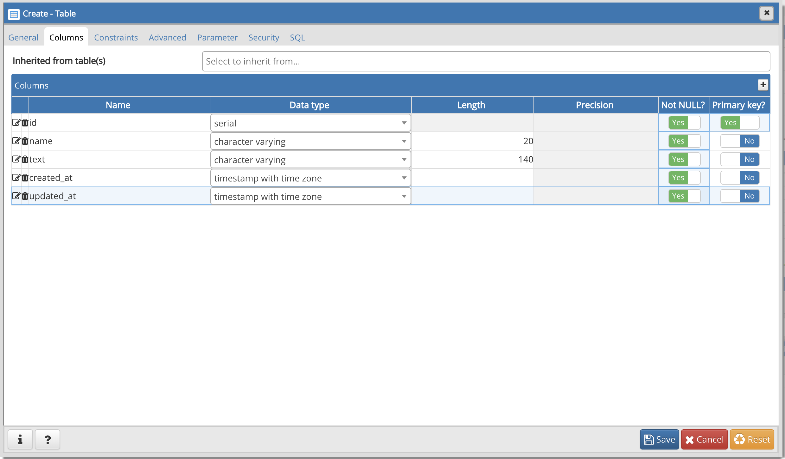

データの種類の型とは、例えば数字のデータ型(Integer)、変長文字列のデータ型（character varying）、日時のデータ型（timestamp）といったものがあります。  
テーブルのデータの取り決めには、指定がなかった場合に入る値（デフォルト値）、データを入れるときにその項目が空でも良いかどうか（NULL設定）、検索によく使う項目を指定する事で検索を速くする（INDEX）など色々なものがあります。

様々なデータ型や設定項目があり、用途によって使い分けることでデータベースのパフォーマンスが大きく変わります。余裕がある方はテーブル設計について色々調べてみるといいかもしれません。

ここで、idに設定したデータ型「serial」は、PostgreSQLで自動的な連番のカラムを作りたい時に使えるデータ型です。  
更に、デフォルト値を設定したいので、フォームのカラムの左端にある、鉛筆とノートのようなアイコンをクリックします。
すると以下のような画面になります。

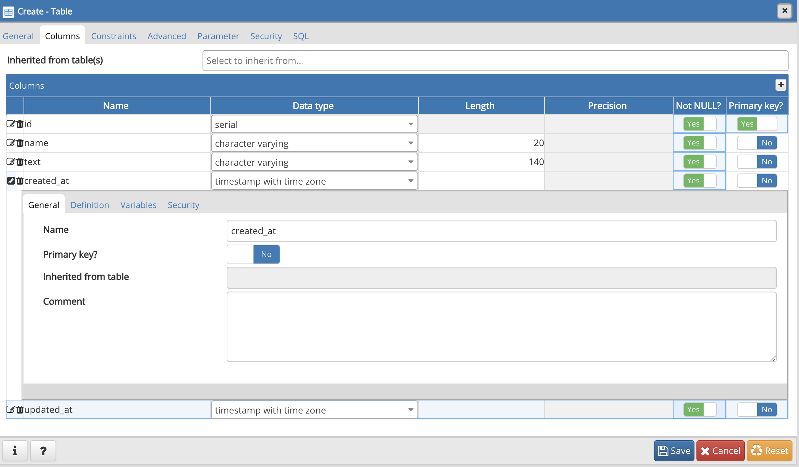

ここで「created_at」（データを作った時間）には、データを入れた時の時間が自動で入って欲しいので、「Definision」タブを開いて「Default Value」に「CURRENT_TIMESTAMP」と入力しておきましょう。

「updated_at」も同じように設定します。
これで、テーブル設定項目の入力が終わりました。  
「Save」ボタンをクリックしてテーブルの登録を完了させましょう。

設定に問題がなければ、以下のような画面に遷移し、テーブルが作成できたことが確認できるはずです。

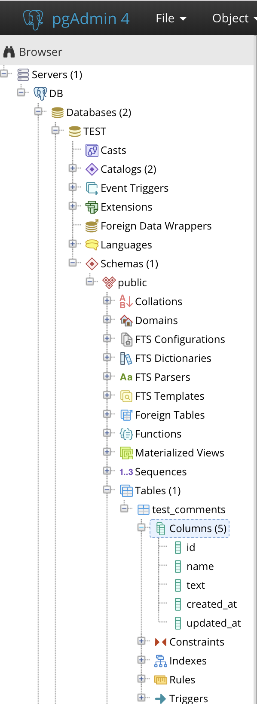

なお、テーブル作成の設定項目は以下に記述しておきますので参考にしてください。  

テーブル名：test_comments

|カラム名|データ型|NULL|デフォルト値|その他|
|--|--|--|--|--|
|id|serial|NG|-|AI|
|name|character varying(20)|NG|-|-|
|text|character varying(140)|NG|-|-|
|created_at|timestamp|NG|CURRENT_TIMESTAMP|-|
|updated_at|timestamp|NG|CURRENT_TIMESTAMP|-|
