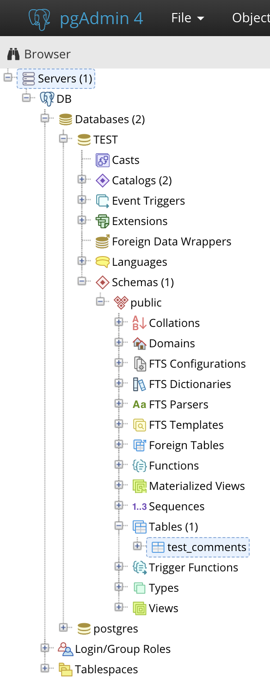
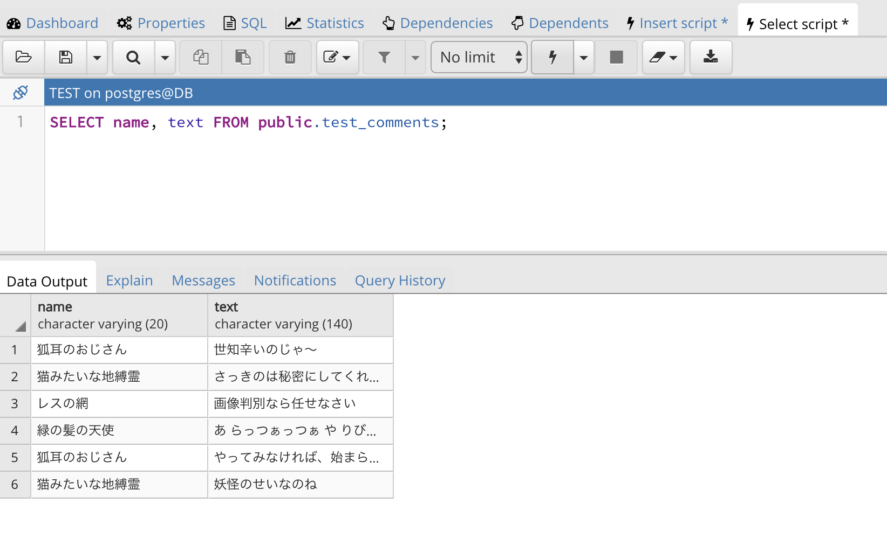
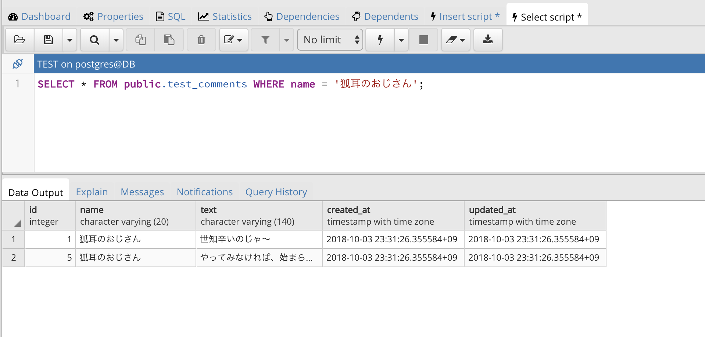
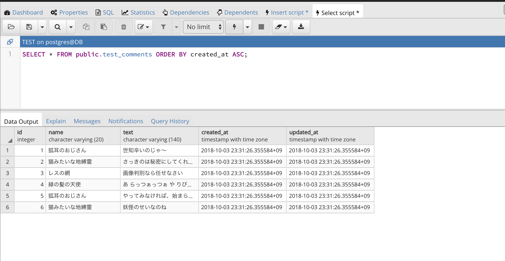
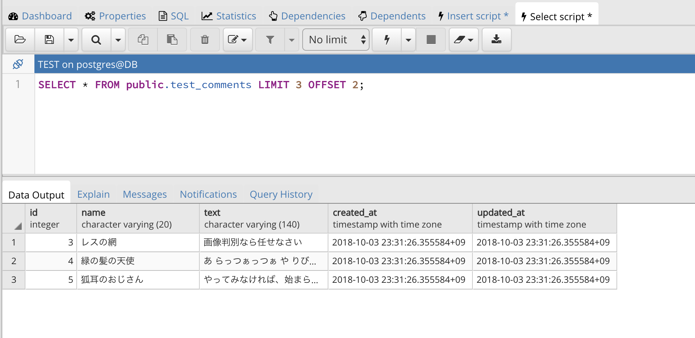
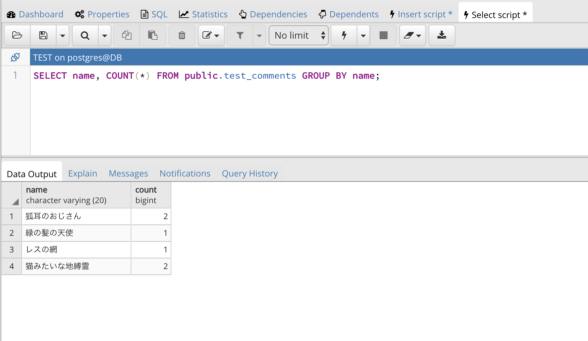
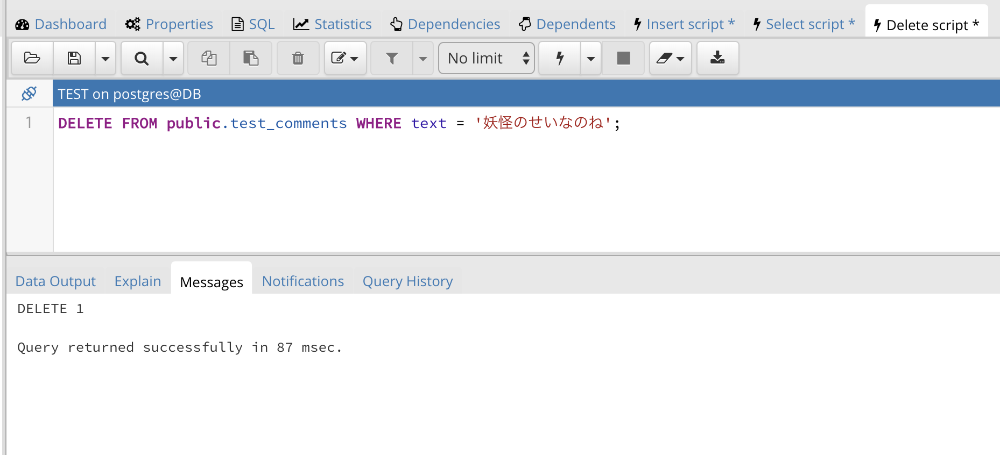
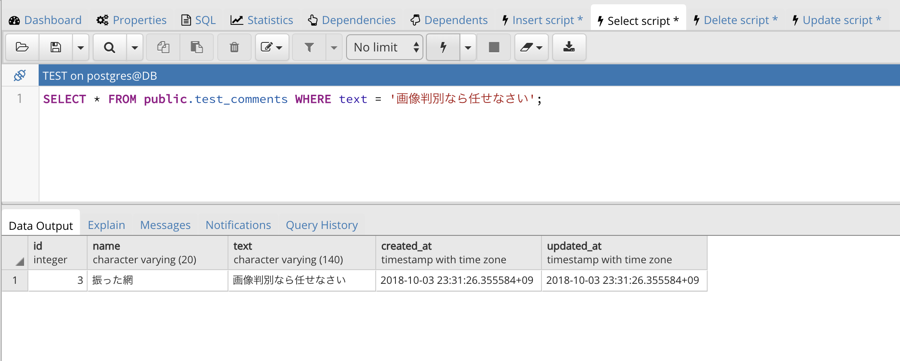

# STEP1-8.SQLを書いてみる

## pgAdminからSQLを書き込む

7では、視覚的にわかりやすい[UI](http://e-words.jp/w/%E3%83%A6%E3%83%BC%E3%82%B6%E3%83%BC%E3%82%A4%E3%83%B3%E3%82%BF%E3%83%BC%E3%83%95%E3%82%A7%E3%83%BC%E3%82%B9.html)を備えたpgAdmin用いてデータベースの操作してみました。  
実際のデータベースの操作はクエリ(処理要求をSQLという言語によって文字列で表したもの)を用いて行います。  
pgAdminを利用すると様々な操作をブラウザ上で簡単に行うことができますが、自分のWebサイトでデータベースを利用するにはプログラムからSQLによるクエリを発行する必要があります。

そこで、今度はSQLによってデーターベースの操作をしてみましょう。  
pgAdminでは、SQLからDBを操作することも可能なのでやってみましょう。  
pgAdminのページをブラウザから開き、左側のメニューから7で作成したテーブル「test_comments」を選択したら準備は完了です。

  


## INSERT文

データの追加にはINSERT文を使用します。  
右クリックして「Scripts＞INSERT Script」をクリックするか上のタブから「Object＞Scripts＞INSERT Script」をクリックしましょう。  


次に、開いたフォームに以下のように入力して、カミナリマークをクリックしましょう。


INSERTが成功している場合は、スクリーンショットのように、フォームの下に「Query returned successfully」と出力されているはずです。

SQL文を少し解説しましょう。

```sql
INSERT INTO public.test_comments(name, text)
	VALUES ('狐耳のおじさん', '世知辛いのじゃ〜');
```

このSQL文は「test_comments」テーブルに、「name」が'狐耳のおじさん'、「text」に'世知辛いのじゃ〜'という値のデータを追加する意味のクエリ（問い合わせ・処理）のになります。  
ここでは、テーブル定義で作成していた「id」「created_at」「updated_at」カラムの値が省略されていることに気がつくと思います。これはテーブルの作成時（[07.データベースについて](../07-db.md)）にAIやデフォルト値を設定してあるためです。

ちなみに、データはカンマで区切ることで複数同時に追加することもできます。  
いくつか値を追加してみましょう。


```sql
INSERT INTO public.test_comments(name, text)
	VALUES ('猫みたいな地縛霊', 'さっきのは秘密にしてくれにゃん'),
		('レスの網', '画像判別なら任せなさい'),
		('緑の髪の天使', 'あ らっつぁっつぁ や りびだびりん'),
		('狐耳のおじさん', 'やってみなければ、始まらない！'),
		('猫みたいな地縛霊', '妖怪のせいなのね');
```

1件の場合と同じように、フォームに上記SQL文を入力して、カミナリマークをクリックすることでINSERTが実行できます。


## SELECT文

データを取得するときはSELECT文を使用します。  

右クリックして「Scripts＞SELECT Script」をクリックするか上のタブから「Object＞Scripts＞SELECT Script」をクリックしましょう。  
INSERT文を作った時と同じようにフォームが開くと思います。

デフォルトで開くフォームに書き込まれているSQL文が「test_comments」テーブルに登録されているデータを全件取得するSQL文になっているので、そのままカミナリマークをクリックしましょう。


```sql
SELECT id, name, text, created_at, updated_at
	FROM public.test_comments;
```
このSQL文を実行すると「test_comments」テーブルに登録されたデータの全てを取得されます。  

特定のカラム（列）のデータだけを取得したい時は、「SELECT」の後にカラムを指定することで絞り込めます。

例えば、「name」と「text」だけに絞り込む場合は、次のように記述します。
```sql
SELECT name, text FROM public.test_comments;
```

このSQL文を実行すると以下のように、「name」と「text」だけの値が表示されます。




### SELECT文の後ろにつける句

SELECT文の後ろには、句というものを付けて使用することが殆どです。
句を使うと、レコード（行）を絞ったり、データの取得する順番を指定したり、SELECT文の中でデータを計算して出したり、色々なことができます。また句は複数組み合わせて使用することもできます。
基本的な句と使用例を見てましょう。

#### WHERE句

WHERE句は、取得するレコード（行）を絞る条件を指定できます。
例えば「name」でレコードを絞ってみましょう。
```sql
SELECT * FROM public.test_comments WHERE name = '狐耳のおじさん';
```




WHERE以下に`name = '狐耳のおじさん'`と記述することで、「name」が「狐耳のおじさん」のレコードだけが抽出されることになるのです。
因みに、このSQL文で、SELECTの後ろに書き込まれた「`*`」は「全てのカラム」を意味します。


#### ORDER BY句

ORDER BY句は、データの取得する順番を指定できます。
作成日時が遅い順に取得してみましょう。
```sql
SELECT * FROM public.test_comments ORDER BY created_at ASC;
```



`created_at ASC`と記述することで、「created_at」カラムの値を古い順番に並び替えてくれます。
因みに、「ASC」は古い順（昇順）に並び替えますが、「DESC」だと新しい順（降順）に並び替えてくれます。


#### LIMIT OFFSET句

LIMIT OFFSET 句は、取得するレコードの位置と数を指定できます。
例えば、２番目のレコードから３件（４番目のレコード）のレコードを取得してみましょう。
```sql
SELECT * FROM public.test_comments LIMIT 3 OFFSET 2;
```



`LIMIT 3 OFFSET 2`の部分で、２番目のレコード（最初のレコードは0番目と数えます）から３件という意味になります。  
ただし、SQLの構文はデータベースシステムごとに微妙に異なり、LIMIT OFFSET句はPostgreSQL独自の構文となっているので、PostgreSQL以外のデータベースシステムを使う時は注意が必要です。

#### GROUP BY句、COUNT関数

GROUP BY句は、データをグループ化し、集計した結果を返すように指定できます。
COUNT関数は句ではないですが、和の計算結果のカラム（列）を追加できます。
それでは、「name」に入っているデータでグループ分けをして、その「name」を持つデータが何個ずつ存在しているかを検索してみましょう。
```sql
SELECT name, COUNT(*) FROM public.test_comments GROUP BY name;
```



`COUNT(*)`はデータの数という意味になります。
`GROUP BY name`で「name」の文字列でまとめるという意味になります。

このような、句や関数はまだまだあり、組み合わせることで色々なデータを抽出することができるので、色々試してみてください。


## DELETE文

今度はデータを削除してみましょう。
データの削除にはDELETE文を使用します。

右クリックして「Scripts＞DELETE Script」をクリックするか上のタブから「Object＞Scripts＞DELETE Script」をクリックしましょう。  
INSERT文やSELECT文を作った時と同じようにフォームが開くと思います。

「test_comments」テーブルに登録されているデータから「text」が「妖怪のせいなのね」となっているレコードだけを削除してみましょう。
```sql
DELETE FROM public.test_comments WHERE text = '妖怪のせいなのね';
```

INSERT文やSELECT文を実行した時と同じように、フォームに上記SQL文を入力して、カミナリマークをクリックすることでDELETE文が実行できます。



このDELETE文を見ると、SELECT文とよく似ており、`DELETE`の部分を`SELECT * `にしたら、「text」カラムの文字列が「妖怪のせいなのね」というレコードを検索するSQL文になっていることがわかると思います。
FROM以降の文で削除対象となるレコードの条件を指定し、その条件で抽出されるレコードを削除する文と考えるとここでは理解しやすいと思います。


## UPDATE文

最後にレコードの更新をしてみましょう。
レコードの更新にはUPDATE文を使用します。

右クリックして「Scripts＞UPDATE Script」をクリックするか上のタブから「Object＞Scripts＞UPDATE Script」をクリックしましょう。  
INSERT文やSELECT文、DELETE文を作った時と同じようにフォームが開くと思います。

UPDATE文も更新対象を絞るやり方はSELECT文と同じように指定します。
それでは、「text」が「画像判別なら任せなさい」となっているレコードの「name」の値を変えてみましょう。
```sql
UPDATE public.test_comments
	SET name = '振った網' WHERE text = '画像判別なら任せなさい';
```

これまでのSQL文を実行した時と同じように、フォームに上記SQL文を入力して、カミナリマークをクリックすることでUPDATE文が実行できます。


先ほどのDELETE文と同じように、WHERE以下の`WHERE text = '画像判別なら任せなさい'`で更新対象となるレコードの検索文を記述しています。
そして`SET name = '振った網'`で「name」の値をどんな値に変更するかを指定しているのです。

変更が反映されているか、SELECT文を使ってみてみましょう。  
SELECT Scriptタブを開いて、以下のSQLを入力して、カミナリマークをクリックします。

```sql
SELECT * FROM public.test_comments WHERE text = '画像判別なら任せなさい';
```

ちゃんと変更ができていれば、以下のような結果になります。




これで、主要なデータベースのSQL文による操作の説明は終わりです。  
SQL文もその書き方で、色々なことができるとともに、大きくパフォーマンスが変わるので、色々なSQL文を試してみましょう。  


***

**[課題]SQLを使ってみよう**  
まずはINSERT文でさらに10個くらいデータを追加してみましょう。次にSELECT文やUPDATE文などを色々試してみましょう。掲示板として表示する際はどのようなクエリが必要になるかも考えてみましょう。
