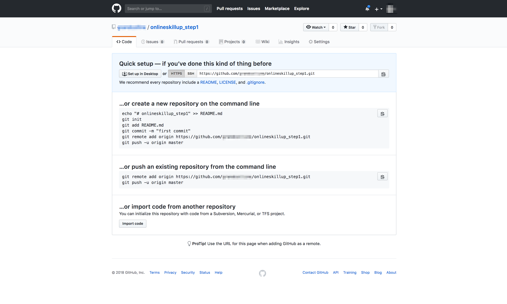

# STEP1-10.GitとGitHubについて

STEP1で今まで作ってきたファイルのバージョンを管理してみましょう。ここでは、
**[Git](https://git-scm.com/)** というツールを使いソースコードのバージョン管理を行い、
**[GitHub](https://github.com/)** というサービスで他の人と共有をしてみます。  


## Gitでバージョン管理しよう！

### Gitのインストール

自分のパソコンにGitをインストールをします。

macの方はデフォルトでGitが入っていますので、何もしなくても大丈夫です。  
Windowsの方は、以下のサイトなどを参考にして、Git for Windowsをインストールしてみてください。  
https://qiita.com/toshi-click/items/dcf3dd48fdc74c91b409

一旦、Gitがインストールされているか確かめてみましょう。  
ターミナル/コマンドプロンプトを開き下記のコマンドを実行してみてください。
Windowsの方はコマンドプロンプトを開くとき、右クリックメニューから管理者権限で実行しましょう。

```
git --version
```

gitのバージョンが確認できればOKです！

### 初期設定

Gitの初期設定をします。

念のため自分のソースコードのバックアップをとった上、ターミナル/コマンドプロンプトを開き、次のコマンドを実行してみましょう。

```
# 作成したソースコードがあるフォルダに移動（/appでなくその上の階層）
cd <フォルダ>

# Gitの初期化を行う
git init

# ユーザの設定(こちらは後ほど登録するGitHubのアカウント名にしておくと良いでしょう)
git config --local user.name <GitHubユーザ名>
git config --local user.email <メールアドレス>
```

### Gitの仕組みを簡単に学ぶ

Gitはコミットという単位で、ソースコードの変更を管理しています。  
コミットには、
- コミットハッシュ：一意に定めるための識別番号
- 作成者：ファイルの編集をしたユーザ名
- 作成時間：コミットした時間
- コミットメッセージ：どんな修正をしたかなどのメモ

などの情報がつきます。

実際に開発していく中では、「ファイルの修正をいくつかする→コミットするファイルの選択→コミット→修正する→コミットするファイルの選択→コミット」を繰り返していく作業となります。  
コミット単位で管理されていますので、過去のコミットの時点などに戻したりすることができるようになります。


### コミットしよう

すでにファイルは修正済みかと思いますので、先ずはコミットするファイルを選択する作業をします。
下記のコマンドで、コミットするファイルを選択します。

```
git add <ファイル名>
```

ファイルごと選択せずに全てのファイルを選択する場合は、 `--all` オプションを使います。
今回は最初のコミットなので全てのファイルを選択で問題ないかと思います。

```
git add --all
```

次にコミットします。

```
git commit -m "<コミットメッセージ>"
```

というコマンドで、先ほど選択したファイルをコミットします。  
コミットメッセージというのは、少し前に説明した通り「どのような修正をしたかのメモ」のようなものです。
自分以外の人に伝える意図もありますので、完結かつ分かりやすいメッセージを心がけましょう。
今回は最初のコミットですので、「最初のコミット」とでもつけておきます。

```
git commit -m "最初のコミット"
```

これで、コミットは完了です。  
コミットするファイルの選択（`add`）→コミット（`commit`）はよく使うコマンドなので、覚えておくと良いでしょう。


### コミットを確認する

下記のコマンドを実行して、先ほどのコミットを確認してみましょう。

```
git log
```

- コミットハッシュ
- 作成者
- 作成時間
- コミットメッセージ

などが表示されたことは確認できたでしょうか。

現在はコミットが1つしかありませんが、コミットが増えると出る量も増えていきます。
下に行くほど古いコミットになります。


## GitHubでコードを共有しよう！

### Githubとは

Gitを使って自分の手元でバージョン管理ができるようになったと思います。  
[GitHub](https://github.com)は、インターネット上でソースコードをコミット単位で共有できるサービスです。過去のコミットを見たり、ユーザ同士がソースコードをレビューしあったりしています。

実際に作ったソースコードをGitHubにアップしてみましょう。


### GitHubアカウント作成

[アカウントを作成](https://github.com/join)にアクセスし、個人のアカウントを作成しましょう。  
すでにアカウントをお持ちの方は既存のアカウントを使っていただいてOKです。


### リポジトリ作成

GitHub上で、リポジトリを作成します。レポジトリというのはアプリケーションのソースやデータの格納場所のことです。
上のタブの `Repositories` からレポジトリ一覧ページに進み、 `New` ボタンを押し、名前をつけて新しいレポジトリを作成します。ここでは、仮に「onlineskillup_step1」としてみます。

`https://github.com/<GitHubユーザ名>/onlineskillup_step1`

このようなURLのページが出来上がっているはずです。
中身はまだ空ですが、こちらが作成したレポジトリになります。




### ローカルと紐づける

ローカルのGit管理されたフォルダとGitHubのレポジトリの紐付け作業を行います。  
この作業は1回行えば、次回からはしなくて良い作業となります。

```
# 作成したソースコードがあるフォルダに移動（/appでなくその上の階層）
cd <フォルダ>

# レポジトリに紐付け
git remote add origin https://github.com/<GitHubユーザ名>/onlineskillup_step1.git
```


### ソースコードをあげる

上で作成したレポジトリにソースコードをあげます。この行為を「プッシュ」と言います。

```
# 変更をプッシュする(パスワードが聞かれたら、GitHubの登録時のパスワードを入力)
git push -u origin master
```

ブラウザでレポジトリに移動し、ファイルがあがっていることを確認してください。  
https://github.com/team-lab/skillup-php-step1 と同じような形になっていればOKです。  
（`/app`以下に自分の書いたコードがプラスされているイメージ）


## もっと詳しく

Gitについては[GitBook](http://git-scm.com/book/ja)に詳しく書かれているので参考になります。
Chapter1でGitの基本やインストール、Capter2で基本コマンドについて書かれています。

GitクライアントとしてはGitBookにも書かれている[Git for Windows](https://git-for-windows.github.io/)があります。
他にも[GitHub Windows](https://windows.github.com/)や[SourceTree](http://www.sourcetreeapp.com/)といったクライアントが主に使われています。
どのクライアントも同じgitの作業はできます。

GitHubについては[GitHub入門](http://www.slideshare.net/hideaki_honda/gitgithub-16508298)が参考になります。また、[ギットクエスト](http://gigazine.net/news/20160126-gitquest-review/)のようなものもあり、勉強になります。

***  

**[課題]Gitを使いこなしてみよう**  
Gitは開発をスムーズにするための機能がたくさんあります。余裕があれば、Gitの基礎から学ぶことのできる[入門サイト](http://www.backlog.jp/git-guide/)やGitのコマンドを説明してくれる[チュートリアル](https://www.atlassian.com/ja/git/tutorial)などが公開されていますので、色々なコマンドを使ってみて、Gitによるバージョン管理に慣れてみましょう。
