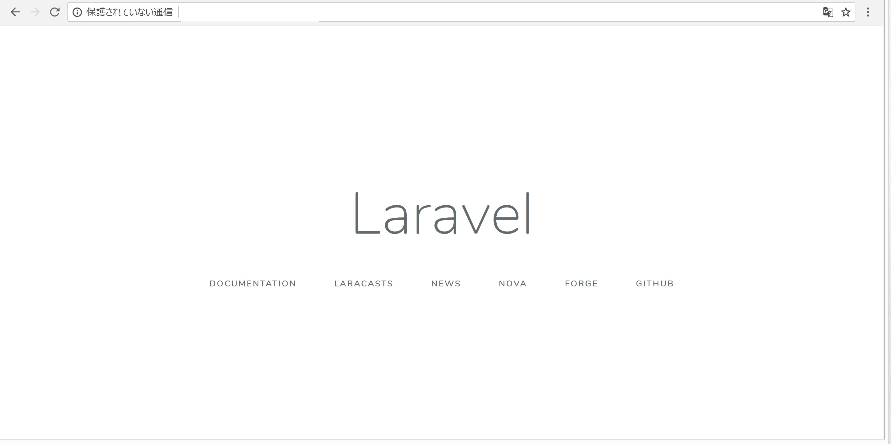

# STEP2-2.Laravelを導入してみよう

STEP1同様に、STEP2の開発環境もDockerを使って整えることができます。
LaravelのDockerを使った開発環境をLaradockを使って構築してみましょう。  
なお、Step1-4ですでにdocker環境を整えていることを前提に説明は進めていきます。

## Laravelの開発環境を作成して初期画面を表示しよう

まず作業するディレクトリを作成して、そこに移動しましょう。
projectnameは自分の作業用のプロジェクトの名前にしましょう。
```
$ mkdir projectname
$ cd projectname
$ git init
```

作成したディレクトリにlaradockをcloneでDLしましょう。
```
$ git submodule add https://github.com/Laradock/laradock.git
```

次にlaradockの設定ファイルを書き換えましょう。
DLしてきたlaradockの階層に移動し、設定ファイルを用意します。
```
$ cd laradock
$ cp env-example .env
```

設定ファイル(.env)のAPP_CODE_PATH_HOSTの部分を書き換えます。
```diff
- APP_CODE_PATH_HOST=../
+ APP_CODE_PATH_HOST=../src
```
これで「projectname/src/」の下の階層がアプリケーションのコードを格納するディレクトリとみなされるようになります。

それでは、実際にworkspaceを立ち上げてみましょう。
```
$ docker-compose up -d workspace nginx
```

コンテナの起動状況を確認してみます。
```
$ docker-compose ps
Name                          Command              State                     Ports
---------------------------------------------------------------------------------------------------------------
laradock_docker-in-docker_1   dockerd-entrypoint.sh           Up       2375/tcp
laradock_nginx_1              nginx                           Up       0.0.0.0:443->443/tcp, 0.0.0.0:80->80/tcp
laradock_php-fpm_1            docker-php-entrypoint php-fpm   Up       9000/tcp
laradock_workspace_1          /sbin/my_init                   Up       0.0.0.0:2222->22/tcp
```
上記のようなコンテナ稼働状態になっていれば、ここまでうまくいっています。

さらに、workspaceコンテナの中にLaravelのアプリケーションを作ります。
```
$ docker-compose exec workspace bash
# composer create-project laravel/laravel . --prefer-dist
# exit
```
うまくいけば「projectname/src/」の下の階層にアプリケーションのコードが生成され、Laravelが動いている状態になります。  
初期画面を確認してみましょう。  
Windowsであれば「[http://192.168.99.100](http://192.168.99.100)」にアクセス  
Macであれば「[http://localhost](http://localhost)」にアクセス  
「Laravel」のデフォルト画面が表示されるはずです。  


## DBも使ってみよう
DBはPostgreSQLを利用します。  
step1と同様にWindows環境ではDBのデータ永続化をすると起動しない場合があるので、その場合はlaradock階層にある「docker-compose.yml」を以下のように書き換えてください。

```diff
### PostgreSQL ###########################################
    postgres:
      build: ./postgres
-      volumes:
-        - ${DATA_PATH_HOST}/postgres:/var/lib/postgresql/data
-        - ${POSTGRES_ENTRYPOINT_INITDB}:/docker-entrypoint-initdb.d
+#      volumes:
+#        - ${DATA_PATH_HOST}/postgres:/var/lib/postgresql/data
+#        - ${POSTGRES_ENTRYPOINT_INITDB}:/docker-entrypoint-initdb.d
      ports:
        - "${POSTGRES_PORT}:5432"
      environment:
        - POSTGRES_DB=${POSTGRES_DB}
        - POSTGRES_USER=${POSTGRES_USER}
        - POSTGRES_PASSWORD=${POSTGRES_PASSWORD}
      networks:
        - backend
```

PostgreSQLの起動には以下のようにします
```
$ docker-compose up -d postgres
```

起動後にコンテナ起動状況を確認すると以下のようになるはずです。
```
$ docker-compose ps
Name                          Command              State                    Ports
--------------------------------------------------------------------------------------------------------------
laradock_docker-in-docker_1   dockerd-entrypoint.sh           Up      2375/tcp
laradock_nginx_1              nginx                           Up      0.0.0.0:443->443/tcp, 0.0.0.0:80->80/tcp
laradock_php-fpm_1            docker-php-entrypoint php-fpm   Up      9000/tcp
laradock_postgres_1           docker-entrypoint.sh postgres   Up      0.0.0.0:5432->5432/tcp
laradock_workspace_1          /sbin/my_init                   Up      0.0.0.0:2222->22/tcp
```

laravelからのDB接続設定もしておきましょう。  
src配下に生成されている「.env」ファイルを編集します。
```diff
- DB_CONNECTION=mysql
- DB_HOST=127.0.0.1
- DB_PORT=3306
- DB_DATABASE=homestead
- DB_USERNAME=homestead
- DB_PASSWORD=secret
+ DB_CONNECTION=pgsql
+ DB_HOST=postgres
+ DB_PORT=5432
+ DB_DATABASE=default
+ DB_USERNAME=default
+ DB_PASSWORD=secret
```

これで、laravelからPostgreSQLへの接続が可能になっています。  


## workspaceコンテナと実行するコマンドについて

今後の節では、今回立ち上げたworkspaceコンテナ内でコマンドを実行することが何回かあります。  
workspaceコンテナは、今回使用するlaravelの実態があるコンテナです。  
新しく使用したいPHPのパッケージを追加したり、laravelの開発用コマンドを使う場合には、workspaceコンテナの中でコマンドを実行することになります。

コンテナに入るコマンドは以下のようなコマンドになります。
```
$ docker-compose exec workspace bash
```

コンテナから出るコマンドは次のようになります。
```
# exit
```

workspaceコンテナ内で実行するコマンドはおそらく以下の２種類になります。  

### composer

PHPのパッケージ管理システムのコマンドです。  
Laravelのプロジェクトを作成したり、パッケージを追加したり、削除したりできます。  
本節中でも、プロジェクトの作成に使用されています。


### php artisan

Laravelのコマンドインターフェイスです。  
コントローラやモデルのひな形にできるPHPファイルを自動で作成できたり、データベースマイグレーションの実行などが行えます。  
詳しくは公式の[イントロダクション](https://readouble.com/laravel/5.7/ja/artisan.html)をみてみてください。
