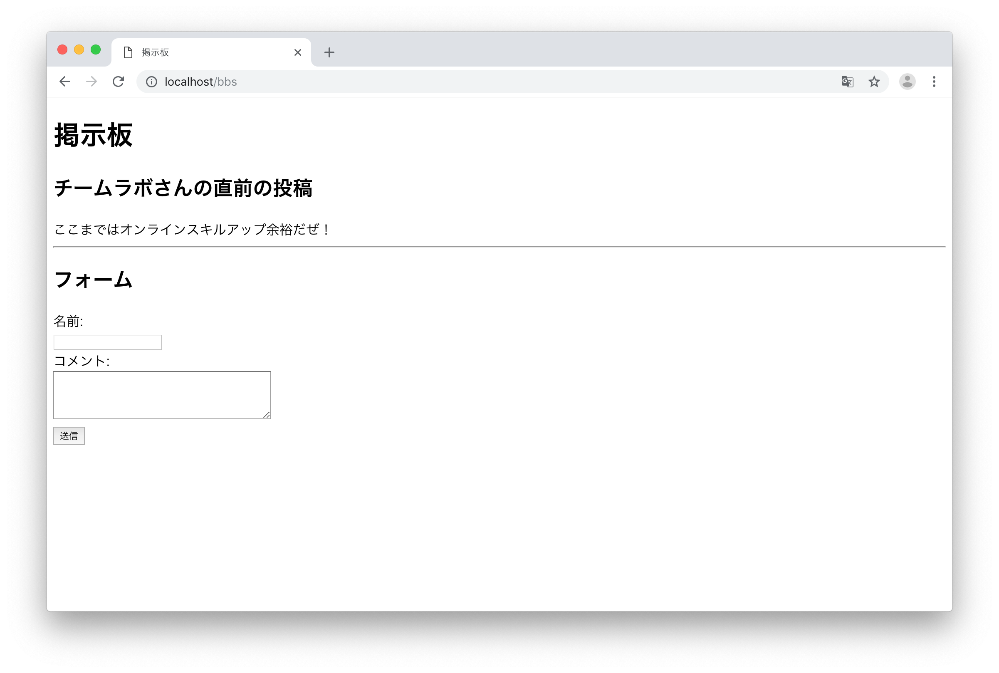
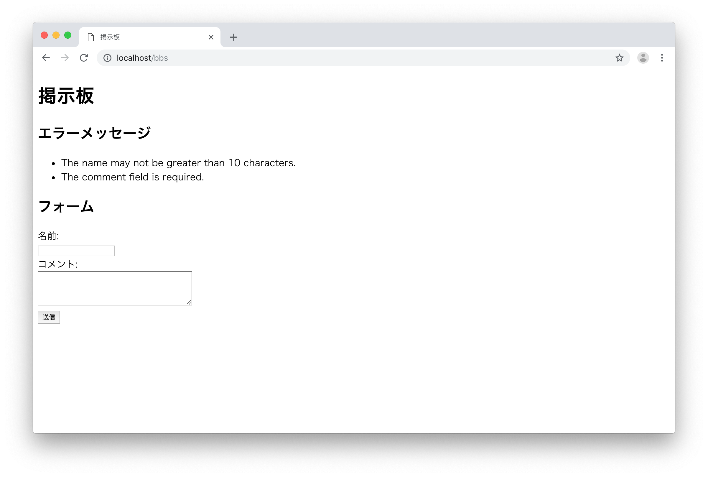

# STEP2-4. 入力フォームを作ってみよう

ここからはSTEP1で作った掲示板をLaravelを使って作ってみます。
この章では入力フォームからPOSTを投げて表示するところまでを実装していきます。


## 入力フォームを作る

まずは、入力フォームを作ってみましょう。  
`/bbs` でアクセスできるように、`routes/web.php`の一番下に下記を追記します。

```php
Route::get('/bbs', 'BbsController@index');
```
`/bbs` にアクセスが来た場合にBbsControllerのindex関数を参照します。

次に、その参照先である、BbsControllerを作っていきましょう。  
`app/Http/Controllers/BbsController.php`というファイルを作成してください。

中身は以下のようにします。

```php
<?php

namespace App\Http\Controllers;

use Illuminate\Http\Request;

class BbsController extends Controller
{
    // Indexページの表示
    public function index() {
        return view('bbs.index');
    }

}
```
参照先であるindex関数は、bbs.indexのビューを返すだけの単純な関数ですね。

最後にビューを作ります。  
`resources/views/bbs`というディレクトリを作ってください。その中に`index.blade.php`というファイルを作ります。
そのファイルの中身は以下です。

```Blade
<!DOCTYPE HTML>
<html>
<head>
    <title>掲示板</title>
</head>
<body>

<h1>掲示板</h1>

<!-- フォームエリア -->
<h2>フォーム</h2>
<form action="/bbs" method="POST">
    名前:<br>
    <input name="name">
    <br>
    コメント:<br>
    <textarea name="comment" rows="4" cols="40"></textarea>
    <br>
    {{ csrf_field() }}
    <button class="btn btn-success"> 送信 </button>
</form>

</body>
</html>
```

フォームの送り先は、POSTメソッドで`/bbs`（つまり自分自身）です。要素は下記の3つです。
* name
* comment
* _token

`name`と`comment`は見たままですね。`_token`は`{{ csrf_field() }}`の部分の実装となります。
フォームのセキュリティを高めるためのLaravelの機能です。詳しくは[こちら](https://readouble.com/laravel/5.1/ja/routing.html#csrf-protection)に説明があります。
とても大切なことですが、現時点ではあまり深く意識しなくても大丈夫でしょう。

では、ページにアクセスしてみましょう。

http://localhost/bbs


うまく表示されたでしょうか？

ちなみにコメント投稿をしてみると・・・・  
はい。当然エラーになりますね。POSTでの受け口をまだ作っていないからです。次はその実装をしていきます。


## POSTを受け取る

投稿された項目を受け取って表示してみましょう。

まずは受け口を作ります。
`routes/web.php`の一番下に下記を追記してください。

```php
Route::post('/bbs', 'BbsController@create');
```

先ほどと同じパスですが、メソッドが違いますね。POSTで受け取った際にはBbsControllerのcreate関数を参照します。

`app/Http/Controllers/BbsController.php`にcreate関数を作成します。
```php
<?php

namespace App\Http\Controllers;

use Illuminate\Http\Request;

class BbsController extends Controller
{
    // Indexページの表示
    public function index() {
        return view('bbs.index');
    }

    // 投稿された内容を表示するページ
    public function create(Request $request) {

        // 投稿内容の受け取って変数に入れる
        $name = $request->input('name');
        $comment = $request->input('comment');

        // 変数をビューに渡す
    	return view('bbs.index')->with([
    	    "name" => $name,
            "comment"  => $comment,
        ]);
    }

}
```
create関数の中を見てみましょう。
やってることは単純で、まずは受け取った`$request`からnameとcommentを取り出し、
それぞれ`$name`と`$comment`という変数に代入しています。
その後、view_withの関数を使って、`$name`をnameという名前、`$comment`をcommentという名前でビューに渡しています。
ビューは先ほどと同じ`bbs.index`です。

では、最後にビューに修正を加えましょう。  
`resources/views/bbs/index.blade.php`のフォーム上部に受け取った値を表示してみます。下記のように書き換えてください。

```Blade
<!DOCTYPE HTML>
<html>
<head>
    <title>掲示板</title>
</head>
<body>

<h1>掲示板</h1>

<!-- 直前投稿エリア -->
@isset($name, $comment)
<h2>{{ $name }}さんの直前の投稿</h2>
{{ $comment }}
<br><hr>
@endisset

<!-- フォームエリア -->
<h2>フォーム</h2>
<form action="/bbs" method="POST">
    名前:<br>
    <input name="name">
    <br>
    コメント:<br>
    <textarea name="comment" rows="4" cols="40"></textarea>
    <br>
    {{ csrf_field() }}
    <button class="btn btn-success"> 送信 </button>
</form>

</body>
</html>
```

下記の部分が追記になりました。
```php
<!-- 直前投稿エリア -->
@isset($name, $comment)
<h2>{{ $name }}さんの直前の投稿</h2>
{{ $comment }}
<br><hr>
@endisset
```
index.blade.phpは`$name`や`$comment`がない場合も使われるので、
`@isset`〜`@endisset`を使って、この２つの変数が存在する場合のみ内部を表示します。

では、http://localhost/bbs にアクセスし、投稿してみましょう。



投稿した内容が表示されていればOKです！

## 投稿にバリデーションをかけてみる

最後にバリデーションの実装をしてみます。今回は以下を満たしていない時にエラーを出すようにします。

* 名前
	* 必須
	* 10文字以内
* コメント
	* 必須
	* 5文字以上、140文字以内

リクエストが投げられた時に判定をするので、BbsControllerのcreate関数にバリデーションチェックを追加します。  
Laravelにvalidateという関数が用意されており、これを利用すれば簡単に実装することができます。`app/Http/Controllers/BbsController.php`を下記のようにします。

```php
<?php

namespace App\Http\Controllers;

use Illuminate\Http\Request;

class BbsController extends Controller
{
    // Indexページの表示
    public function index() {
        return view('bbs.index');
    }

    // 投稿された内容を表示するページ
    public function create(Request $request) {

        // バリデーションチェック
        $request->validate([
            'name' => 'required|max:10',
            'comment' => 'required|min:5|max:140',
        ]);

        // 投稿内容の受け取って変数に入れる
        $name = $request->input('name');
        $comment = $request->input('comment');

        // 変数をビューに渡す
    	return view('bbs.index')->with([
    	    "name" => $name,
            "comment"  => $comment,
        ]);
    }
}
```

create関数に下記の部分を追加するのみです。
```php
// バリデーションチェック
$request->validate([
    'name' => 'required|max:10',
    'comment' => 'required|min:5|max:140',
]);
```

では、ビュー側にエラーメッセージを表示するようにしましょう。

```Blade
<!DOCTYPE HTML>
<html>
<head>
    <title>掲示板</title>
</head>
<body>

<h1>掲示板</h1>

<!-- エラーメッセージエリア -->
@if ($errors->any())
    <h2>エラーメッセージ</h2>
    <ul>
        @foreach ($errors->all() as $error)
            <li>{{ $error }}</li>
        @endforeach
    </ul>
@endif

<!-- 直前投稿エリア -->
@isset($name, $comment)
    <h2>{{ $name }}さんの直前の投稿</h2>
    {{ $comment }}
    <br><hr>
@endisset

<!-- フォームエリア -->
<h2>フォーム</h2>
<form action="/bbs" method="POST">
    名前:<br>
    <input name="name">
    <br>
    コメント:<br>
    <textarea name="comment" rows="4" cols="40"></textarea>
    <br>
    {{ csrf_field() }}
    <button class="btn btn-success"> 送信 </button>
</form>

</body>
</html>
```

バリデーションの中で自動で`$error`という変数が投げられますので、ビュー側ではこれを拾って表示します。

実際に、バリデーションに引っかかる投稿をしてみましょう。



正しくエラーが出たでしょうか？

お疲れ様でした！この章はこれで終わりです。  
次回は投稿された内容をデータベースに保存してみます。

