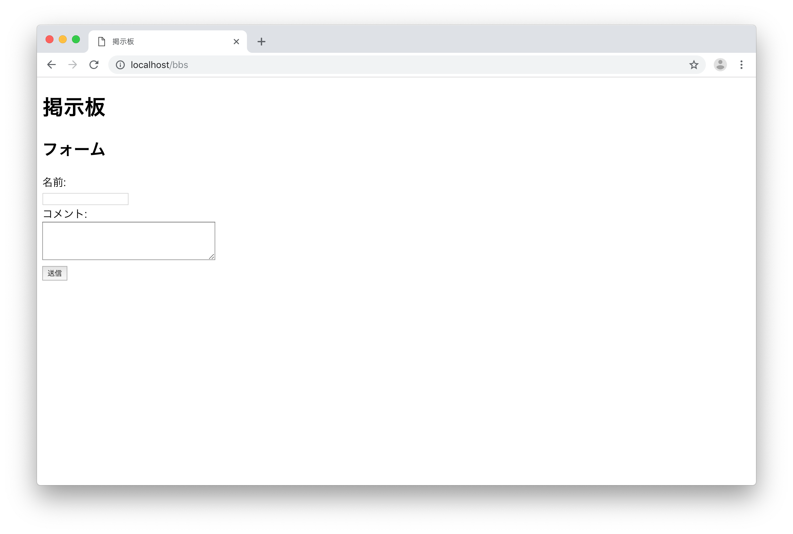

# STEP2-5. 掲示板を作ってみよう

前節で作成した掲示板のデータをデータベースに入れてみましょう！  
この節では、前節の入力フォームからPOSTを投げて、DBに登録して表示するまでを実装していきます。


## データベースマイグレーションについて

データベースのテーブル作成や更新、削除は[STEP1-7.データベースについて](../step1/07-db.md)で説明したようにSQL文を直接実行することでも可能です。  
しかしながらそのままでは、テーブルの作成や変更した記録を追うことが難しくなり、元に戻す場合にも苦労してしまいます。  

そこで、テーブルの作成やカラムの変更などを記録し、管理するための機能が存在しています。  
Laravelでも簡単に使用することができるので、データベースの変更を行う際はデーターベースマイグレーションを使用しましょう。


## bbsテーブルを作成するためのデータベースマイグレーションの実行

それでは、掲示板に利用するデータベースのテーブルをデータベースマイグレーションを使って作成してみましょう。

### 1. マイグレーションファイルを自動生成する

以下のコマンドを入力し、workspaceコンテナに入ります。  
```
$ docker-compose exec workspace bash
```
次に、以下のコマンドを実行しマイグレーションファイルを生成します。
```
$ php artisan make:migration create_bbs_table --create=bbs
```
マイグレーションファイルの生成に成功していれば、

```Created Migration: yyyy_mm_dd_xxxxxx_create_bbs_table```

と言うメッセージがプロンプトに表示され、/var/www/database/migrations/配下に「yyyy_mm_dd_xxxxxx_create_bbs_table」ファイルが存在しているはずです。  
なお、[STEP2-2.データベースについて](./02-environment.md)の「docker-compose.yml」ファイルのVolume設定の通りで起動している場合、「src/database/migrations」階層にも同じファイルが生成されているので、確認してみましょう！  
  

### 2. マイグレーションファイルを編集し必要なカラム情報を追記する

このままデータベースマイグレータを実行すると、時間とIDのみしか記録できないbbsテーブルが作成されることになってしまいます。  
そこで、「/var/www/database/migrations/yyyy_mm_dd_xxxxxx_create_bbs_table」ファイルに必要なカラム情報を追記しましょう。


```php
<?php

use Illuminate\Support\Facades\Schema;
use Illuminate\Database\Schema\Blueprint;
use Illuminate\Database\Migrations\Migration;

class CreateBbsTable extends Migration
{
    /**
     * Run the migrations.
     *
     * @return void
     */
    public function up()
    {
        Schema::create('bbs', function (Blueprint $table) {
            $table->increments('id');
            $table->string('name'); // 追記項目
            $table->string('comment'); // 追記項目
            $table->timestamps();
        });
    }

    /**
     * Reverse the migrations.
     *
     * @return void
     */
    public function down()
    {
        Schema::dropIfExists('bbs');
    }
}
 ```

追加したのは2行だけです。  
前節で作ったフォームの「name」が入る想定のString型のカラム

```php
 $table->string('name');
 ```

前節で作ったフォームの「comment」が入る想定のString型のカラム

```php
 $table->string('comment');
 ```

追記できましたね。これでマイグレーションファイルは完成です！  
安全にテーブルの作成ができるようになりました。


### 3. マイグレーションを実行する

それでは、データベースマイグレータを実行しましょう。  
workspaceコンテナ内で以下のようにコマンドを実行します。

```
$ php artisan migrate
```

うまくいけば、プロンプトには以下のように表示され、テーブルが追加されます！

```
Migrating: yyyy_mm_dd_xxxxxx_create_bbs_table
Migrated:  yyyy_mm_dd_xxxxxx_create_bbs_table
```

これでデータベースにテーブルが追加されています。
操作をしているのはworkspaceコンテナですが、テーブルが作成されたりする実際のデータベースが存在しているのは、postgresコンテナのPostgreSQLであることも覚えておきましょう。


## Bbsテーブルに接続するためのBbsモデルファイルの作成

次に、作成したデータベーステーブルに接続するための設定ファイル（モデル）を作成しましょう。
これもLaravelの機能で自動生成できてしまいますので簡単です。
早速やってみましょう。

### 1. モデルファイルの自動生成

workspaceコンテナ内で以下のようにコマンドを実行します。
```
php artisan make:model bbs
```

うまくいけば、プロンプトには以下のように表示され、ホスト側の「src/app/」の下にBbs.phpファイルが生成されるはずです。

```
Model created successfully.
```


### 2. モデルファイルの編集

自動生成されたモデルファイルを少しだけ編集しましょう。
コントローラー側で使用する、カラムは「name」「comment」の2つだけなので、これを記述します。

```php
<?php
namespace App;


use Illuminate\Database\Eloquent\Model;

class Bbs extends Model
{
   protected $fillable = ['name','comment']; // 追記したところ
}
```

これで、コントローラーからデータベーステーブル「bbs」に接続できるようになりました！


## コントローラーファイルの編集

さぁ、もう少しです。頑張りましょう！  
今度は、コントローラーファイル「BbsController.php」を少し編集します。

```php

<?php
   
   namespace App\Http\Controllers;
   
   use Illuminate\Http\Request;
   use App\Model\Bbs; // さっき作成したモデルファイルを引用
   
   
   class BbsController extends Controller
   {
       // Indexページの表示
       public function index() {
           
           $bbs = Bbs::all(); // 全データの取り出し
           return view('bbs.index', ["bbs" => $bbs]); // bbs.indexにデータを渡す
       }
   
       // 投稿された内容を表示するページ
       public function create(Request $request) {
   
           // バリデーションチェック
           $request->validate([
               'name' => 'required|max:10',
               'comment' => 'required|min:5|max:140',
           ]);
   
           // 投稿内容の受け取って変数に入れる
           $name = $request->input('name');
           $comment = $request->input('comment');
           
           Bbs::insert(["name" => $name, "comment" => $comment]); // データベーステーブルbbsに投稿内容を入れる
   
           $bbs = Bbs::all(); // 全データの取り出し
           return view('bbs.index', ["bbs" => $bbs]); // bbs.indexにデータを渡す
       }
   }
```

変更・追記した箇所は、大きくは３箇所です。

1. 作成されたデータベーステーブル「bbs」に接続するためのモデルファイルを引用する記述。

```php
use App\Model\Bbs;
```

2. データベーステーブル「bbs」に存在するデータを全て取得して、bbs.indexに引き渡す記述。

```php
$bbs = Bbs::all();
return view('bbs.index', ["bbs" => $bbs]);　
```

3. データベーステーブル「bbs」に投稿内容をインサート（登録）するための記述。

```php
Bbs::insert(["name" => $name, "comment" => $comment]);
```

この節の掲示板では、投稿の削除や重複防止、更新機能などはないので、これだけの追記で大丈夫です。  
ここまできたら、ほぼできたも同然です。

## ビューファイルの編集

最後にビューファイル「index.blade.php」を編集しましょう！

```html
<!DOCTYPE HTML>
<html>
<head>
    <title>掲示板</title>
</head>
<body>

<h1>掲示板</h1>

<!-- エラーメッセージエリア -->
@if ($errors->any())
    <h2>エラーメッセージ</h2>
    <ul>
        @foreach ($errors->all() as $error)
            <li>{{ $error }}</li>
        @endforeach
    </ul>
@endif

<!-- 投稿表示エリア（編集するのはここ！） -->
@isset($bbs)
@foreach ($bbs as $d)
    <h2>{{ $d->name }}さんの投稿</h2>
    {{ $d->comment }}
    <br><hr>
@endforeach
@endisset

<!-- フォームエリア -->
<h2>フォーム</h2>
<form action="/bbs" method="POST">
    名前:<br>
    <input name="name">
    <br>
    コメント:<br>
    <textarea name="comment" rows="4" cols="40"></textarea>
    <br>
    {{ csrf_field() }}
    <button class="btn btn-success"> 送信 </button>
</form>

</body>
</html>
```

編集するのは、
```html
<!-- 投稿表示エリア（編集するのはここ！） -->
```
の下7行の部分だけです！

まず、渡している変数が、前節では2つ（「$name」「$comment」）でしたが、今節では「$bbs」の1つのみになりました。  
なので、存在しているかどうかを確認する「@isset」の()内に記述は$bbsに変わっています。

次に「@foreach ($bbs as $d)」という部分を追記しています。  
これは、データベーステーブル「bbs」には、フォーム入力が更新されるたびにレコード(nameとcommentが入った行)が追加されるので、追加された記録全件が$bbsには入っています。  
これを掲示板に表示するために、繰り返し処理をすると言う命令文を書いているのです。  
具体的には、$bbsという変数から、1行つづ($d)取り出して、少し下にある「@endforeach」までの間の処理を繰り返します。

この繰り返される中身、のHTML文章に似た部分では、  
前節では「$name」だった部分が「$d->name 」に、前節では「$comment」だった部分が「$d->comment 」に変わっていることがわかると思います。  
これは「$d」の中にある「name」と「comment」を表示するという意味になります。

これで、掲示板をデータベーステーブル「bbs」を使って構築することができたはずです！


## ブラウザから確認してみよう

それでは、```http://localhost/bbs```にアクセスしてみましょう！



前節の画面と同じ画面が表示されるはずです。

次に、名前とコメントを入力して「送信」ボタンを押してみましょう。


前節とは異なり、何度も実行していくとその分だけ投稿が追加されていくはずです。

確認できたでしょうか？
これで掲示板の基礎中の基礎はできたかと思います。

次節は、いよいよログイン機能を実装していくことになります。

