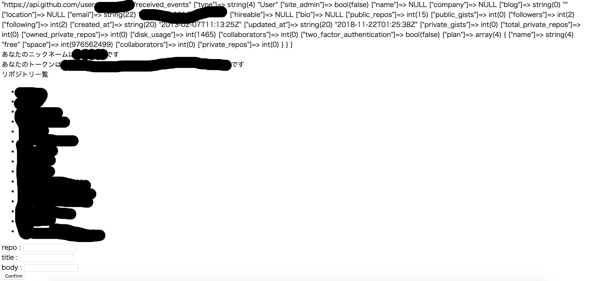
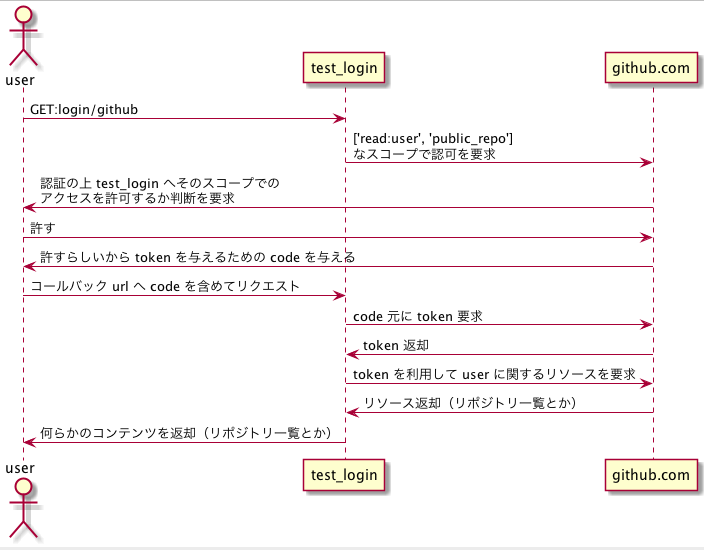

# STEP2-6. ログイン機能の実装

アプリケーション側で独自のIDを保有し、アプリ固有の情報をIDと紐付けます。

IDの認証には外部のサービスが提供している認証基盤を利用して認証処理を実装します。

## 実装に必要な手順

+ laravel 雛形を作成
+ [socialite](https://github.com/laravel/socialite)のインストール
+ [guzzle](https://github.com/guzzle/guzzle)のインストール
+ アプリ登録（今回はgithubとします）
+ 実装 - 認証・認可
+ 実装 - ログイン機能の実装

## laravel 雛形を作成

laradock の利用準備ができている前提で雛形の作成から進めます。
laradock workspace コンテナから下記コマンドを実行して雛形を作成します。

`composer create-project laravel/laravel test-login`

## socialite のインストール

[公式](https://readouble.com/laravel/5.5/ja/socialite.html)の言われるがままに作成した雛形のプロジェクトへインストールを行います

`composer require laravel/socialite`

## guzzle のインストール

[公式](https://github.com/guzzle/guzzle)の言われるがままに作成した雛形のプロジェクトへインストールを行います

`composer require guzzlehttp/guzzle`

## アプリ登録

[公式](https://developer.github.com/apps/building-oauth-apps/creating-an-oauth-app/)の言われるがままにアプリ登録を行います

## 実装 - 認証・認可


* ログインしたユーザのリポジトリ一覧を表示する
* ログインしたユーザとしてissueを発行する

上記なことが行えるようなアプリケーションを実装します。

追加・修正を行ったファイルを下記に記します。

### 1-1. 実装（設定値）

`test-login/.env` を修正

```
APP_NAME=Laravel
APP_ENV=local
APP_KEY=base64:jzP79v5XJFc2spSWU6iQsvDioZpCNUNK4g6YtieCk/Y=
APP_DEBUG=true
APP_URL=http://localhost

LOG_CHANNEL=stack

DB_CONNECTION=mysql
DB_HOST=127.0.0.1
DB_PORT=3306
DB_DATABASE=homestead
DB_USERNAME=homestead
DB_PASSWORD=secret

BROADCAST_DRIVER=log
CACHE_DRIVER=file
QUEUE_CONNECTION=sync
SESSION_DRIVER=file
SESSION_LIFETIME=120

REDIS_HOST=127.0.0.1
REDIS_PASSWORD=null
REDIS_PORT=6379

MAIL_DRIVER=smtp
MAIL_HOST=smtp.mailtrap.io
MAIL_PORT=2525
MAIL_USERNAME=null
MAIL_PASSWORD=null
MAIL_ENCRYPTION=null

PUSHER_APP_ID=
PUSHER_APP_KEY=
PUSHER_APP_SECRET=
PUSHER_APP_CLUSTER=mt1

MIX_PUSHER_APP_KEY="${PUSHER_APP_KEY}"
MIX_PUSHER_APP_CLUSTER="${PUSHER_APP_CLUSTER}"

GITHUB_CLIENT_ID={`アプリ登録` で取得した値を利用してください} # 追加！
GITHUB_CLIENT_SECRET={`アプリ登録` で取得した値を利用してください} # 追加！
```

`test-login/config/services.php` を修正

```php
<?php

return [

    /*
    |--------------------------------------------------------------------------
    | Third Party Services
    |--------------------------------------------------------------------------
    |
    | This file is for storing the credentials for third party services such
    | as Stripe, Mailgun, SparkPost and others. This file provides a sane
    | default location for this type of information, allowing packages
    | to have a conventional place to find your various credentials.
    |
    */

    'github' => [
        'client_id' => env('GITHUB_CLIENT_ID'),         // 追加！
        'client_secret' => env('GITHUB_CLIENT_SECRET'), // 追加！
        'redirect' => '/login/github/callback',
    ],

    'mailgun' => [
        'domain' => env('MAILGUN_DOMAIN'),
        'secret' => env('MAILGUN_SECRET'),
        'endpoint' => env('MAILGUN_ENDPOINT', 'api.mailgun.net'),
    ],

    'ses' => [
        'key' => env('SES_KEY'),
        'secret' => env('SES_SECRET'),
        'region' => env('SES_REGION', 'us-east-1'),
    ],

    'sparkpost' => [
        'secret' => env('SPARKPOST_SECRET'),
    ],

    'stripe' => [
        'model' => App\User::class,
        'key' => env('STRIPE_KEY'),
        'secret' => env('STRIPE_SECRET'),
        'webhook' => [
            'secret' => env('STRIPE_WEBHOOK_SECRET'),
            'tolerance' => env('STRIPE_WEBHOOK_TOLERANCE', 300),
        ],
    ],

];
```

### 1-2. 実装（ルーティング）

`test-login/routes/web.php` を修正

```php
<?php

/*
|--------------------------------------------------------------------------
| Web Routes
|--------------------------------------------------------------------------
|
| Here is where you can register web routes for your application. These
| routes are loaded by the RouteServiceProvider within a group which
| contains the "web" middleware group. Now create something great!
|
*/

Route::get('/', function () {
    return view('welcome');
});

Route::get('github', 'Github\GithubController@top');// 追加！
Route::post('github/issue', 'Github\GithubController@createIssue');// 追加！

Route::get('login/github', 'Auth\LoginController@redirectToProvider');// 追加！

Route::get('login/github/callback', 'Auth\LoginController@handleProviderCallback');// 追加！
```

### 1-3. 実装（コントローラ）

`test-login/app/Http/Controllers/Auth/LoginController.php` を修正

```php
<?php

namespace App\Http\Controllers\Auth;

use App\Http\Controllers\Controller;
use Illuminate\Foundation\Auth\AuthenticatesUsers;
use Socialite;// 追加！
use Illuminate\Http\Request;// 追加！

class LoginController extends Controller
{
    /*
    |--------------------------------------------------------------------------
    | Login Controller
    |--------------------------------------------------------------------------
    |
    | This controller handles authenticating users for the application and
    | redirecting them to your home screen. The controller uses a trait
    | to conveniently provide its functionality to your applications.
    |
    */

    use AuthenticatesUsers;

    /**
     * Where to redirect users after login.
     *
     * @var string
     */
    protected $redirectTo = '/home';

    /**
     * Create a new controller instance.
     *
     * @return void
     */
    public function __construct()
    {
        $this->middleware('guest')->except('logout');
    }

    /**
     * GitHubの認証ページヘユーザーをリダイレクト
     *
     * @return \Illuminate\Http\Response
     */
    public function redirectToProvider()// 追加！
    {
        return Socialite::driver('github')->scopes(['read:user', 'public_repo'])->redirect(); 
    }

    /**
     * GitHubからユーザー情報を取得
     *
     * @return \Illuminate\Http\Response
     */
    public function handleProviderCallback(Request $request)// 追加！
    {
        $user = Socialite::driver('github')->user();

        $request->session()->put('github_token', $user->token);
        return redirect('github');
    }
}
```


`example-auth/app/Http/Controllers/Github/GithubController.php` を追加

```php
<?php

namespace App\Http\Controllers\Github;

use App\Http\Controllers\Controller;
use Socialite;
use Illuminate\Http\Request;

class GithubController extends Controller
{
    public function top(Request $request)
    {
        $token = $request->session()->get('github_token', null);

        try {
            $user = Socialite::driver('github')->userFromToken($token);
        } catch (\Exception $e) {
            return redirect('login/github');
        }

        $client = new \GuzzleHttp\Client();
        $res = $client->request('GET', 'https://api.github.com/user/repos', [
            'headers' => [
                'Authorization' => 'token ' . $token
            ]
        ]);
    
        return view('github', [
            'info' => var_dump($user),
            'nickname' => $user->nickname,
            'token' => $token,
            'repos' => array_map(function($o) {
                return $o->name;
            }, json_decode($res->getBody()))
        ]);
    }

    public function createIssue(Request $request)
    {
        $token = $request->session()->get('github_token', null);
        $user = Socialite::driver('github')->userFromToken($token);

        $client = new \GuzzleHttp\Client();
        $res = $client->request('POST', 'https://api.github.com/repos/' . $user->user['login'] . '/' . $request->input('repo') . '/issues', [
            'headers' => [
                'Authorization' => 'token ' . $token
            ],
            'json' => [
                'title' => $request->input('title'),
                'body' => $request->input('body')
            ]
        ]);
    
        return view('done', [
            'response' => json_decode($res->getBody())->html_url
        ]);
    }
    
}
```

### 1-4. 実装（ビュー）

`test-login/resources/views/done.blade.php` を追加

```Blade
<!doctype html>
<html lang="{{ str_replace('_', '-', app()->getLocale()) }}">
    <head>
        <meta charset="utf-8">
        <meta name="viewport" content="width=device-width, initial-scale=1">

        <title>github</title>
    </head>
    <body>
        {{ $response }}
        つくったよ
    </body>
</html>
```

`test-login/resources/views/github.blade.php` を追加

```Blade
<!doctype html>
<html lang="{{ str_replace('_', '-', app()->getLocale()) }}">
    <head>
        <meta charset="utf-8">
        <meta name="viewport" content="width=device-width, initial-scale=1">

        <title>github</title>
    </head>
    <body>
        <div>{{ $info }}</div>
        <div>あなたのニックネームは{{ $nickname }}です</div>
        <div>あなたのトークンは{{ $token }}です</div>
        <div>リポジトリ一覧</div>
        <ul>
        @foreach($repos as $repo)
            <li>{{ $repo }}</li>
        @endforeach
        </ul>

        <form action="/github/issue" method="post">
            {{ csrf_field() }}

            <div>repo : <input type="text" name="repo"></div>

            <div>title : <input type="text" name="title"></div>

            <div>body : <input type="text" name="body"></div>

            <input type="submit" value="Confirm">
        </form>
    </body>
</html>
```

### 実行結果

`/github` へ直接アクセスすると未だ認証・認可されてないので `login/github` へリダイレクトされます。
その後取得された token を持って認可された操作が行えるようになります。



ほとんど伏せてますが
+ ユーザ情報
+ 認証したユーザのリポジトリ一覧

が表示されているはずです。

また、フォームに リポジトリ一覧から任意のリポジトリをコピペし、title、 body を入力すれば指定したリポジトリに issue が作られることが確認できます。


### トークン取得までの流れ



トークンが取得され次第 test_login アプリケーションが user の権限を以って github.com へリソースアクセスを行います

## 実装 - ログイン機能

認証・認可の仕組みを理解できたところで、ログイン機能を実装します。
具体的な内容は下記となります。

+ ログインフォームがある
+ ログイン後、IDと紐づくような情報の確認、編集ができる

尚、実装内容は 認証・認可 が実装完了してることを前提としています。

### 1-1. DBテーブルのセットアップ

artisan を利用したマイグレーションを利用します
下記コマンドを workspace コンテナ上で実行してマイグレーションを生成します

`php artisan make:migration create-table`

ファイルは下記のパスに生成されます。

`test-login/database/migrations/2018_12_03_101836_create-table.php`

そして、内容を下記のように修正します。

```php
<?php

use Illuminate\Support\Facades\Schema;
use Illuminate\Database\Schema\Blueprint;
use Illuminate\Database\Migrations\Migration;

class CreateTable extends Migration
{
        /**
     * マイグレーション実行
     *
     * @return void
     */
    public function up()
    {
        Schema::create('user', function (Blueprint $table) {
            $table->increments('id');
            $table->string('name')->nullable();
            $table->string('comment')->nullable();
            $table->string('github_id');
            $table->timestamps();
        });
    }

    /**
     * マイグレーションを元に戻す
     *
     * @return void
     */
    public function down()
    {
        Schema::drop('user');
    }
}

```

artisan コマンドでマイグレーションを行います
workspace コンテナ側でプロジェクト直下の `.env` ファイルの db に関する設定を変更します

`test-login/.env`

```
DB_CONNECTION=pgsql
DB_HOST=laradock_postgres_1
DB_PORT=5432
DB_DATABASE=default
DB_USERNAME=default
DB_PASSWORD=secret
```

設定が完了しました。workspace コンテナ側でマイグレーションを行います

`php artisan migrate`

下記のような出力が表示されたら成功です。

```
Migration table created successfully.
Migrating: 2014_10_12_000000_create_users_table
Migrated:  2014_10_12_000000_create_users_table
Migrating: 2014_10_12_100000_create_password_resets_table
Migrated:  2014_10_12_100000_create_password_resets_table
Migrating: 2018_12_03_101836_create-table
Migrated:  2018_12_03_101836_create-table
```

本当にテーブルが作成されていたか確認してみます。

```sql
default-# \d user;
                                       Table "public.user"
   Column   |              Type              |                     Modifiers                     
------------+--------------------------------+---------------------------------------------------
 id         | integer                        | not null default nextval('user_id_seq'::regclass)
 name       | character varying(255)         | 
 comment    | character varying(255)         | 
 github_id  | character varying(255)         | not null
 created_at | timestamp(0) without time zone | 
 updated_at | timestamp(0) without time zone | 
Indexes:
    "user_pkey" PRIMARY KEY, btree (id)
```

なんやら created_at と updated_at は自動で生成されるようです。

### 1-2. 実装（ルーティング）

`test-login/routes/web.php` に下記1行を追加しました

```
Route::post('user', 'User\UserController@updateUser');
```

### 1-3. 実装（コントローラ）

`test-login/app/Http/Controllers/User/UserController.php` を追加

```php
<?php

namespace App\Http\Controllers\User;

use App\Http\Controllers\Controller;
use Illuminate\Http\Request;
use Socialite;
use Illuminate\Support\Facades\DB;

class UserController extends Controller
{
    public function updateUser(Request $request)
    {
        $token = $request->session()->get('github_token', null);
        $user = Socialite::driver('github')->userFromToken($token);

        DB::update('update user set name = ?, comment = ? where github_id = ?', [$request->input('name'), $request->input('comment'), $user->user['login']]);
        return redirect('/github');
    }    
}
```

`test-login/app/Http/Controllers/Auth/LoginController.php` を修正

handleProviderCallback 関数を下記のように修正

```php
	public function handleProviderCallback(Request $request)
    {
        $github_user = Socialite::driver('github')->user();

        $now = date("Y/m/d H:i:s");
        $app_user = DB::select('select * from public.user where github_id = ?', [$github_user->user['login']]);
        if (empty($app_user)) {
            DB::insert('insert into user (github_id, created_at, updated_at) values (?, ?, ?)', [$github_user->user['login'], $now, $now]);
        }
        $request->session()->put('github_token', $github_user->token);
        
        return redirect('github');
    }
```

DBを利用するための記載を追加

```php
use Illuminate\Support\Facades\DB;
```


`test-login/app/Http/Controllers/Github/GithubController.php` を修正

top 関数を修正
```php
	public function top(Request $request)
    {
        $token = $request->session()->get('github_token', null);

        try {
            $github_user = Socialite::driver('github')->userFromToken($token);
        } catch (\Exception $e) {
            return redirect('login/github');
        }

        $client = new \GuzzleHttp\Client();
        $res = $client->request('GET', 'https://api.github.com/user/repos', [
            'headers' => [
                'Authorization' => 'token ' . $token
            ]
        ]);

        $app_user = DB::select('select * from public.user where github_id = ?', [$github_user->user['login']]);

        return view('github', [
            'user' => $app_user[0],
            'nickname' => $github_user->nickname,
            'token' => $token,
            'repos' => array_map(function($o) {
                return $o->name;
            }, json_decode($res->getBody()))
        ]);
    }
```

DBを利用するための記載を追加

```php
use Illuminate\Support\Facades\DB;
```

### 1-4. 実装（ビュー）

`test-login/resources/views/github.blade.php` を修正

```Blade
<!doctype html>
<html lang="{{ str_replace('_', '-', app()->getLocale()) }}">
    <head>
        <meta charset="utf-8">
        <meta name="viewport" content="width=device-width, initial-scale=1">

        <title>github</title>
    </head>
    <body>
        <form action="/user" method="post">
            {{ csrf_field() }}

            <div>お名前 : <input type="text" name="name" value="{{$user->name}}"></div>

            <div>コメント : <input type="text" name="comment" value="{{$user->comment}}"></div>


            <input type="submit" value="Confirm">
        </form>
        <div>ようこそ{{ $nickname }}さん</div>
        <div>あなたのトークンは{{ $token }}です</div>
        <div>リポジトリ一覧</div>
        <ul>
        @foreach($repos as $repo)
            <li>{{ $repo }}</li>
        @endforeach
        </ul>

        <form action="/github/issue" method="post">
            {{ csrf_field() }}

            <div>repo : <input type="text" name="repo"></div>

            <div>title : <input type="text" name="title"></div>

            <div>body : <input type="text" name="body"></div>

            <input type="submit" value="Confirm">
        </form>
    </body>
</html>
```

`test-login/resources/views/welcome.blade.php` を修正

```Blade
<!doctype html>
<html lang="{{ str_replace('_', '-', app()->getLocale()) }}">
    <head>
        <meta charset="utf-8">

        <title>ログイン画面</title>
    </head>
    <body>
        <a href="/login/github">githubアカウントでログイン</a>
    </body>
</html>
```

### 動作確認

user テーブルが空の状態でログインを試みてみます
```sql
default=# select * from public.user;
 id | name | comment | github_id | created_at | updated_at 
----+------+---------+-----------+------------+------------
(0 rows)
```

`http://localhost/` から リンクを押して `/github` へ遷移します。

user テーブルに1つのレコードが追加されました

```sql
default=# select * from public.user;
 id | name | comment | github_id |     created_at      |     updated_at      
----+------+---------+-----------+---------------------+---------------------
  1 |      |         | hogefuga  | 2018-12-21 07:32:24 | 2018-12-21 07:32:24
(1 row)

```

もう一度同じ手順を踏んでもレコードは増えません。

github.com の認証を経て test-login アプリ側のIDと github.com 側のIDが紐づいたと言えます。


お名前, コメント を入力の上 Confirm を押すとレコードの値が更新されていることがわかります。

```sql
default=# select * from public.user;
 id | name | comment | github_id |     created_at      |     updated_at      
----+------+---------+-----------+---------------------+---------------------
  1 | test | test    | hogefuga | 2018-12-21 08:30:13 | 2018-12-21 08:30:13
(1 row)
```

## まとめ

+ 認証・認可の処理を github 側に任せることができた
+ 作成したアプリ側のIDとgithub側のIDを紐づけることができた

最後まで読んでいただいてありがとうございました。