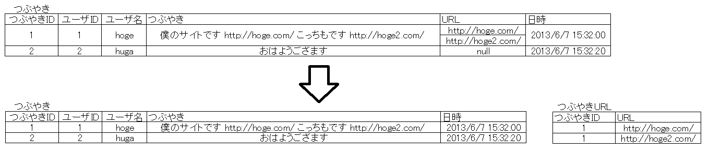

# STEP2-9.データベースを設計してみよう

前回の画面仕様書を元に、作成するサイトに必要となるデータベースを設計してみましょう。ここでは非常に簡単に説明します。詳細の説明は[4ステップで作成する、DB論理設計の手順とチェックポイントまとめ](https://qiita.com/nishina555/items/a79ece1b54faf7240fac)などを参照してください。

データベース設計には概念設計、論理設計、物理設計の3つのフェーズがあります。

## 概念設計
まずはデータベースで何を管理するかということを明確にするために概念モデルを作成します。

### エンティティ抽出
エンティティとはデータベースで管理する実体です。例として[つぶやき画面]からは以下のようなエンティティと属性が抽出できます。

* つぶやき：ユーザ名、本文、日時
* ユーザ：ユーザ名、投稿数、フォロー数、フォロワー数

他の画面からもエンティティを抽出し、過不足がないか確認します。

### リレーションシップ設定
各エンティティの関係を設定します。リレーションシップには一対一、一対多、多対多の3種類があります。今回の場合、ユーザとつぶやきは一対多の関係、ユーザ同士のフォローは多対多の関係となります。

## 論理設計
概念設計で作成した概念モデルをリレーショナルデータベースで扱える形式（リレーショナルモデル、つまり表）に変換する作業です。まずは多対多の関係はテーブルで表現できないため、中間テーブルを作成することによって2つの一対多の関係に分割して取り除きます。

多対多の関係が取り除かれたらテーブルに変換することができます。しかし、そのままではリレーショナルモデルとして非常に良くない形であるため正規化によって修正します。

### 第1正規化
複数の値が含まれる列を別のテーブルに分割する作業です。

### 第2,第3正規化
ある項目が決まると一意に定まる項目を別のテーブルに分割する作業です。これは、1つのデータはただ1回だけ書かれるべきであるというリレーショナルデータベースの原則に則っています。例えば上記のつぶやきテーブルでは、ユーザIDが分かるとユーザ名は一意に定まるためユーザ名は必要ありません。

## 物理設計
作成したリレーショナルモデルから実際にテーブルを作成します。使用できるデータ型や制約はデータベースシステムごとに異なるため、PostgreSQLについて説明します。

### データ型
各列のデータ型を適切に決定します。主に以下のような型があります。もっと詳しい内容や、これら以外の型については[日本PostgreSQLユーザ会の公式ドキュメント](https://www.postgresql.jp/document/10/html/datatype.html)を参照してください。

* INTEGER: 整数型
* DOUBLE: 浮動小数点数型
* DATE: 1日単位で日付のみを表すデータ
* TIMESTAMP: 日付と時刻の両方を表すデータ
* CHAR: 固定長文字データ。指定した長さより短CHAR,CLOBい値を挿入したときは、残りは空白で埋められる
* VARCHAR: 可変長文字列
* TEXT: 長さ指定なしの可変長文字列
* BYTEA: バイナリ型(バイナリデータ（「バイトの配列（byte array）」）)

### 制約
格納できるデータを制限します。制約は最大限定義しておくべきです。主に以下のような制約があります。もっと詳しい内容や、これら以外の型については[日本PostgreSQLユーザ会の公式ドキュメント](https://www.postgresql.jp/document/10/html/datatype.html)を参照してください。

* NOT NULL: NULLの入力を禁止。
* UNIQUE: 他の行との重複を禁止。
* PRIMARY KEY: 主キーとする。NOT NULL + UNIQUE
* FOREIGN KEY: 他の表に存在しない値を禁止。
* CHECK: 条件式によって制限。

### 画像を保存する２つの方法
画像のDB管理には２つの方法があります。
* 画像ファイルをストレージに保存してそのファイルパスを保存する方法
* 画像ファイルの実体をバイナリデータとして保存する方法

今回の課題では最初の「画像ファイルをストレージに保存してそのファイルパスを保存する方法」でお願いします。ただ、Herokuでもきちんと動作させたい人は課題が一通り終わった段階で[こちら](image_document.md)を参考にして後者のテーブル設計をしてください。（これは優先度低くて大丈夫です。）

**[課題]実際に設計しよう**  
前回の画面仕様書を元に、作成するサイトに必要となるデータベースを設計してみましょう。
