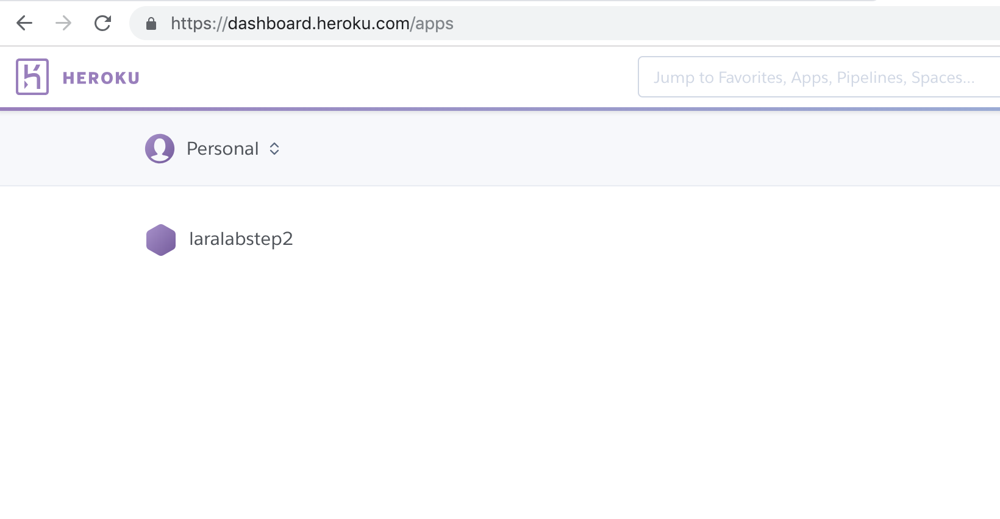

# STEP2-10.Herokuで公開してみよう

今までのステップで、オリジナルのWebサービスをLaravelを使って作成する最低限の知識は手に入れられたはずです！  
いよいよ今回は、作成したWebサービスを公開してみましょう。  

サービスは様々な方法で公開できますが、今回はHerokuを用いて公開する方法を紹介します。  
Herokuは、無料でPHPとPostgreSQLを使用することができ、早い速度でローカル開発したサービスを公開することができます。  

## Herokuに登録してみよう

まずは、[HerokuのWebサービス](https://jp.heroku.com/)にアクセスして、利用者登録をしましょう。  
会社名は必須ではないので空白でも大丈夫です。  
また、開発言語の選択も影響があるものではないので、適当で大丈夫です。  


登録をクリックすると、入力したメールアドレスに認証リンクが送られてきます。  
リンクから接続して、パスワードを設定しましょう。 


これでHerokuへの登録は完了です。


## 作ったサービスを公開してみよう


### HerokuToolbeltをインストールする

次に、コマンドラインからHerokuを操作するために、HerokuToolbeltをインストールしましょう。  
こちらの[リンク](https://devcenter.heroku.com/articles/heroku-cli)から、MacとWindowsそれぞれのインストール方法の記述に従って、インストールしましょう。


### Herokuにサービスの雛形を作成する

HerokuToolbeltのインストールが完了したら、コマンドラインからHerokuを操作していきます。  
まずはログインしましょう。  
なお、入力するEmailやPasswordは、Herokuに登録した時に設定したものです。

```
$ heroku auth:login
Enter your Heroku credentials:
Email: [ユーザ登録したときのメールアドレス]
Password: [ユーザ登録したときのパスワード]
Logged in as [ユーザ登録したときのメールアドレス]
```

ログインができたら、Herokuにサービスを動かすアプリの雛形を作りましょう。  
アプリケーション名は自由に入力してください。
```
$ heroku create [アプリケーション名] --buildpack heroku/php
Creating ⬢ [アプリケーション名]... done
https://git.heroku.com/[アプリケーション名].git
```

うまくいくと、HerokuのWebサービスでも上記で設定したアプリが作成されていることが確認できます。  


なおアプリケーション名は、世界で一意である必要があるので、誰かと被らないような名前をつけましょう。  
すでに使われているとエラーが返されてしまいます。  
この時点のHerokuアプリ（以降作成したHerokuのアプリはHerokuアプリと記載）には、データベースとそのデータの設定や、Laravel、今までの項で作成してきたPHPコードは、どれも反映されていません。  
順番に設定していきましょう。


### Herokuアプリをリモートリポジトリとして登録する

Herokuでは、1-10で説明した「git」を利用してコードをHerokuアプリに反映していくことになります。  
そこで、作ったサービスへHerokuアプリのリポジトリを追加しましょう。

```
$ cd projectname
$ git remote add heroku https://git.heroku.com/[アプリケーション名].git
```
指定しているURLは、一つ前に実行した「heroku create ***」の結果としてコマンドラインに表示されるURLです。  
これで、リモートリポジトリの設定はひとまずOKです。


### HerokuアプリにAPP_KEYを追加する

APP_KEYは、Laravelが行う暗号化やパスワードリセットといった、セキュリティ関係箇所で利用されています。  
「あなたが作ったLaravelのサービスでだけ使える鍵」のようなものというと少しわかりやすいでしょうか。  
そこで、Herokuアプリにも環境変数として設定してあげる必要があります。  

実際に「APP_KEY」を作成し、Herokuアプリの環境変数に「APP_KEY」を指定しましょう。

まず、APP_KEYを生成します。
laradockの階層で実行することに気をつけてください。
```
$ cd projectname/laradock
$ docker-compose exec workspace php artisan --no-ansi key:generate --show
base64:xxxxx
```

この`base64:xxxxx`という文字列がAPP_KEYです。

次にHerokuアプリにAPP_KEYを設定します。
今度は一つ上の階層＝サービスのトップ階層で実行することに気をつけてください。

```
$ cd projectname
$ heroku config:set APP_KEY=base64:xxxxx
Setting APP_KEY and restarting ⬢ [アプリケーション名]... done, v*
APP_KEY: base64:xxxxx
```

エラーなどなければ問題なく設定されています。


### HerokuアプリにPostgreSQLを紐付ける

Herokuは「docker-compose」のように複数のコンテナを”自由に建てて”Webサービスを実現するようにはできていません。  
例えば、PostgreSQLを使用するサービスを公開したい場合は、「Heroku Postgres」というアドオンを使うことになります。  

それでは、早速「Heroku Postgres」を追加していきましょう。

```
$ cd projectname
$ heroku addons:add heroku-postgresql
```

このコマンドで、Herokuがあなた専用のPostgreSQLのデータベースを作成してくれます。  
ただ、そのままでは作成されただけで、Herokuアプリとは紐づけられていませんので、紐付けを行いましょう。  

Herokuが作成したデータベースの情報は「heroku config」で見ることが可能です。

```
$ cd projectname
$ heroku config
DATABASE_URL: postgres://[ユーザ名]:[パスワード]@[ホスト名]:[ポート]/[データベース名]
APP_KEY: base64:xxxxx
```

DATABASE_URLの値がデータベースの情報になります。   
pgAdminから接続したい場合は、本項の最後に接続方法を記載しておくので参考にしてください。  

また、```heroku config```コマンドは、Herokuアプリに設定されている環境変数を表示してくれるコマンドです。  
そのため、実行結果には先ほど設定した```APP_KEY```が存在することも確認しておきましょう。  

データベースの情報がわかったので、Herokuアプリの環境変数にデータベース情報を追加していきます。

```
$ cd projectname
$ heroku config:set DB_CONNECTION=pgsql
$ heroku config:set DB_HOST=[ホスト名]
$ heroku config:set DB_PORT=[ポート]
$ heroku config:set DB_DATABASE=[データベース名]
$ heroku config:set DB_USERNAME=[ユーザ名]
$ heroku config:set DB_PASSWORD=[パスワード]
```
これで、Herokuアプリとデータベースの紐付けができました。


### Herokuアプリの画面パス設定ファイルを作成する

ローカル環境では、HTTPサーバーにnginxを使っています（Laravelの環境構築で「docker-compose up -d nginx」とういうように起動しています）。
HerokuではApacheを使ってみましょう。  

といっても、ここで作成するのは、1行のみの画面パスの設定ファイルだけです。

```
$ cd projectname/src
$ echo web: vendor/bin/heroku-php-apache2 public/ > Procfile
```
このコマンドを実行すると、```web: vendor/bin/heroku-php-apache2 public/```と書き込まれた「Procfile」ファイルが「projectname/src」配下に作成されます。


### Herokuアプリにサービスを反映してみよう

いよいよ、Herokuアプリのリモートリポジトリにgitコマンドを使ってサービスのコードをpushしましょう。

```
$ cd projectname
$ git add .
$ git commit -m 'コミットメッセージ'
$ git subtree push --prefix app/ heroku master
```
最後の行は、app/配下だけpushしているので少し書き方が複雑に見えるかもしれません。  
コマンドラインにHerokuの実行ログのようなものが表示されて、エラーが出なければ、自作のWebサービスコードがHerokuアプリに反映されているはずです！  
ただし、まだサービス公開は完了していません。  
ここではデータベース接続するページはエラーになっている状態になります。

### Herokuのデータベースにマイグレーションを実行する

エラーになるのは、Herokuのデータベースにテーブルや設定が反映されていないためです。  
Herokuに紐付けたデータベースにマイグレーションを実行して、テーブルや設定を反映させましょう。  
まず、migrateをHerokuアプリにインストールします。

```
$ cd projectname
$ heroku run "php artisan migrate:install"

Running php artisan migrate:install on ⬢ laralabstep2... up, run.3189 (Free)
Migration table created successfully.
```

次に、コードでHerokuアプリにマイグレーションファイルが存在することを確認します。

```
$ cd projectname
$ heroku run "php artisan migrate:status"

Running php artisan migrate:status on ⬢ laralabstep2... up, run.9034 (Free)
+------+------------------------------------------------+-------+
| Ran? | Migration                                      | Batch |
+------+------------------------------------------------+-------+
| No   | 2014_10_12_000000_create_users_table           |       |
| No   | 2014_10_12_100000_create_password_resets_table |       |
| No   | 2018_12_18_081501_create_bbs_table             |       |
+------+------------------------------------------------+-------+
```

存在が確認できたら、いよいよ実行します。  
実行時には、本当にマイグレーションを実行していいかの確認が出るので「yes」と打ちましょう。

```
$ cd projectname
$ heroku run "php artisan migrate"

Running php artisan migrate on ⬢ laralabstep2... up, run.4824 (Free)
**************************************
*     Application In Production!     *
**************************************

 Do you really wish to run this command? (yes/no) [no]:
 > yes

Migrating: 2014_10_12_000000_create_users_table
Migrated:  2014_10_12_000000_create_users_table
Migrating: 2014_10_12_100000_create_password_resets_table
Migrated:  2014_10_12_100000_create_password_resets_table
Migrating: 2018_12_18_081501_create_bbs_table
Migrated:  2018_12_18_081501_create_bbs_table
```

お疲れ様でした。  
これで、Herokuのデータベースのテーブル環境もしっかり整ったはずです。


### Herokuアプリにあげたサービスが動いていることを確認する

実際にサービスが動いていることを確認しましょう。  
次のようにコマンドを叩きましょう。

```
$ cd projectname
$ heroku open
```

うまくいっていると、上記コマンドでブラウザが開き、自作のWebサービスが表示されます。  


## Herokuアプリのサービスを更新するには？

Herokuアプリのサービスの変更を反映するときは、「Herokuにサービスを反映してみよう」と同じコマンドで更新ができます。

```
$ cd projectname
$ git add .
$ git commit -m 'コミットメッセージ'
$ git subtree push --prefix app/ heroku master
```

また、データベースのテーブル定義の変更などがある場合は、上記を実行した後に次のようなコマンドを実行して、マイグレーションを反映させましょう。

```
$ cd projectname
$ heroku run "php artisan migrate"

Running php artisan migrate on ⬢ laralabstep2... up, run.4824 (Free)
**************************************
*     Application In Production!     *
**************************************

 Do you really wish to run this command? (yes/no) [no]:
 > yes

Migrating: 2018_12_18_081501_update_bbs_table
Migrated:  2018_12_18_081501_update_bbs_table
```


## Herokuアプリを削除するには？

コマンドラインから以下のように叩くとHerokuアプリが削除されます。

```
$ cd projectname
$ heroku apps:destroy --app [アプリケーション名] --confirm [アプリケーション名]
```

HerokuのWebサービスからでもHerokuアプリの削除は可能です。


## HerokuアプリのログでLaravelのログを確認したい

初期設定では、Herokuアプリのログには、Laravelのエラーログは出力されていません。  
もしLaravelのエラーログをみたい場合は、Herokuアプリの環境変数を設定しましょう。

```
$ cd projectname
$ heroku config:set LOG_CHANNEL: errorlog
```

また、Herokuアプリのログを見るには以下のようにコマンドを叩きます。

```
$ cd projectname
$ heroku logs 
```

これでHerokuアプリのログを確認でき、そこにLaravelのエラーログも一緒に出力されることが確認できるはずです。


## HerokuのPostgreSQLにpgAdminから接続する方法

接続に使うpgAdminは1-7のローカルで立ち上げたコンテナのpgAdminが使用できます。  
pgAdminにログインしたら、HerokuのPostgreSQLのDBサーバを追加しましょう。

Quick Linksの「Add New Server」をクリックするか、左側のServerを選択してから上部のタブにある「Object＞Create＞Server」をクリックしましょう。

ポップアップしたサーバー追加フォームに「heroku config」で入手したDB情報を入力していきます。

```
$ heroku config
DATABASE_URL: postgres://[ユーザ名]:[パスワード]@[ホスト名]:[ポート]/[データベース名]
```

|フォーム|入力内容|
|---|---|
| General＞Name　  | 好きな名前  |
| Connection＞Host name/address  | [ホスト名] |
| Connection＞Port  | [ポート]  |
| Connection＞Maintenance database  |  [データベース名] |
| Connection＞Username  | [ユーザ名]  |
| Connection＞Password  | [パスワード]  |

入力が終わったら「Save」ボタンをクリックしましょう。  
うまくいけば、左側のServerの配下に「General＞Name」で設定した名前のHerokuのデータベースサーバが追加されているはずです。
