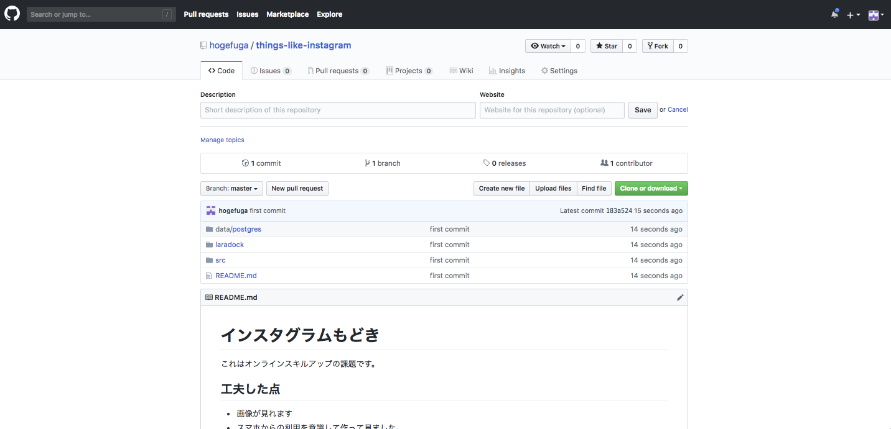

# STEP2-11 最終課題：画像投稿SNSを作成しよう

今までの講座で学んだ知識を駆使して、画像投稿SNSを実装しソースコードをHerokuに公開してみましょう。
余力のある人は動画も表示できるようにしたり、CSSを駆使してデザインを変更したり、障害が発生してもサービスが持続可能な工夫を凝らしたりしてみましょう。

### 製作環境

|項目|内容|
|:-:|:-:|
|使用言語|`PHP`, `HTML`, `CSS`|
|フレームワーク| `laravel` |
|データベース|`PostgreSQL`|
|文字コード（アプリ）|`UTF-8`|
|ソースコード管理|`Git`, `GitHub`|
|サーバ環境|`Heroku`|
|動作環境|最新版のGoogleChrome|

### 仕様

* [仕様書](insta_document.md)を確認してください。

### 提出方法

動作とソースコードをこちらで確認しますので以下2つを提出してください。

1. 「[STEP2-10.Herokuとその使い方について](10-heroku.md)」で作成したHerokuのURL
2. 最終課題で作成したGitHubリポジトリのURL

なお、GitHubリポジトリには以下のファイルをあげるようにしてください。

* Herokuに上がっているソースコードファイル
* 「概要」と「工夫した点」を追記したREADME.mdファイル
* マイグレーションファイル

提出するリポジトリ例のスクリーンショットを用意したので参考にしてみてください。

### 画像や動画がたくさんリポジトリにあってpushできない時は

GitHubでは1ファイルが100MBを超えた場合にpushできなくなります。  
対処方法を[解説するページ](https://qiita.com/kanaya/items/ad52f25da32cb5aa19e6)などもありますので参考にしてください。
