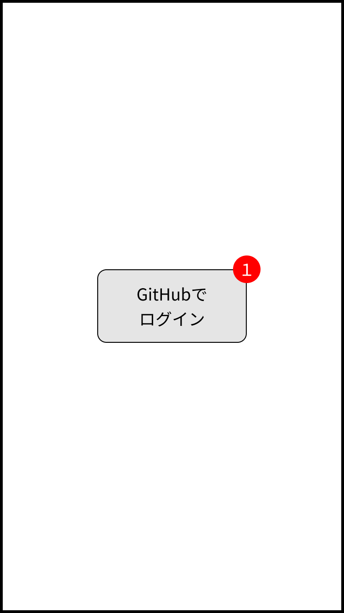
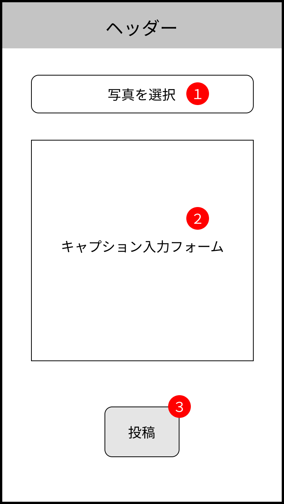
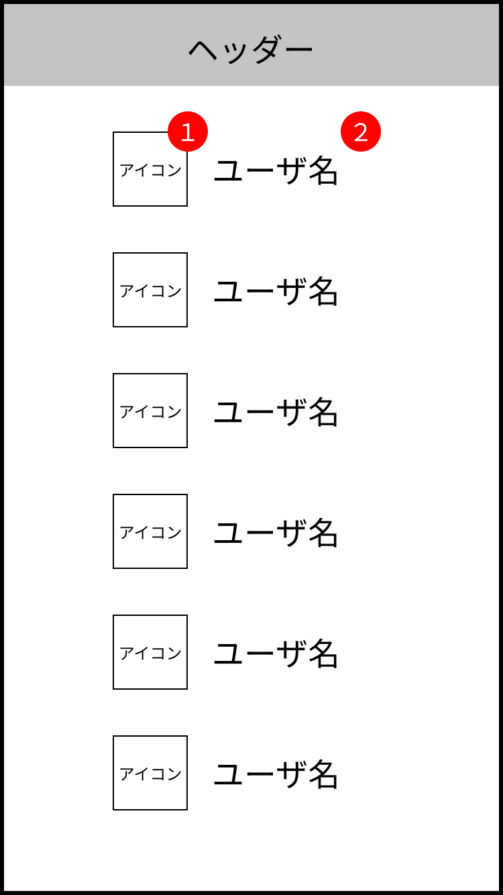

# インスタグラムもどき画面仕様書

**全体構成**

## 共通ヘッダー

**未ログイン時**  

**ログイン時**  

1. ホームボタン  
  押下するとホーム画面に遷移する

2. ログイン・ログアウトボタン  
  ログインしている・していない、の状態によって表示と動作が異なる
    - 未ログイン時  
      ログインボタンを表示  
      押下するとログイン画面に遷移する
    - ログイン時  
      ログアウトボタンを表示  
      押下するとログアウトし、ログイン画面に遷移する

3. 投稿ボタン  
  ログインしている・していない、の状態によって動作が異なる
    - 未ログイン時  
      押下するとログイン画面に遷移する
    - ログイン時  
      押下すると投稿画面に遷移する

## ログイン画面

ログイン済の状態でアクセスした場合、ホーム画面にリダイレクトする

1. ログインボタン  
  押下するとGitHubアカウントでログインし、ホーム画面に遷移する

## ホーム画面

1. ユーザ名  
  GitHubのユーザIDをユーザ名として表示  
  クリックするとそのユーザのプロフィール画面に遷移する

2. 投稿画像

3. キャプション  
  投稿に付与されたキャプション文字列を表示

4. いいねしたユーザ  
  押下するといいねしたユーザ一覧画面に遷移する

5. いいねボタン  
  ログインしている・していない、の状態によって動作が異なる
    - 未ログイン時  
      押下できない（非アクティブ）
    - ログイン時  
      押下するといいねしたユーザがその投稿に紐付き、ボタンの表示が変わる  
      再度押下するといいねが取り消され、ボタンの表示が初期状態に戻る

6. 投稿削除ボタン  
  ログイン中のユーザの投稿にのみ表示  
  押下すると投稿が削除される

7. 前へボタン  
  押下すると前のページに遷移する  
  1ページ目の場合は表示しない

8. 次へボタン  
  押下すると次のページに遷移する  
  次のページがない場合は表示しない

- 1ページあたりの表示件数は10件
- 投稿の表示順は投稿日時の降順（新しい投稿が上に表示される）

## 投稿画面

未ログインの状態でアクセスした場合、ホーム画面にリダイレクトする

1. 画像選択ボタン

  押下で端末内の画像から投稿する画像を選択
      - 選択すると画像がプレビュー表示される
      - 1枚のみ選択可能
      - 選択後の変更も可能

  アップロード画像の制約
      - 画像形式: jpgかpngかgif
      - 画像サイズ: 60MB以下

2. キャプション入力フォーム  
  最大文字数: 200文字

3. 投稿ボタン  
  押下すると入力した内容が投稿され、ホーム画面に遷移する  
  ※ 以下の場合は画面遷移せずエラーメッセージを表示
      - 画像が選択されていない場合
      - 選択された画像が上記の制約に違反している場合
      - キャプションが最大文字数を超えている場合

## プロフィール画面

1. アイコン  
  ユーザのGitHubのアイコンを表示

2. ユーザ名  
  GitHubのユーザIDをユーザ名として表示

3. いいね合計数  
  そのユーザの全ての投稿でいいねされた合計数を表示

4. 投稿画像一覧  
  ユーザが投稿した画像を全て表示  
  投稿の表示順は投稿日時の降順（新しい投稿が上に表示される）

## いいねしたユーザ一覧画面

1. アイコン  
  投稿にいいねしたユーザのアイコン  
  押下するとそのユーザのプロフィール画面に遷移する

2. ユーザ名  
  投稿にいいねしたユーザのユーザ名  
  押下するとそのユーザのプロフィール画面に遷移する
